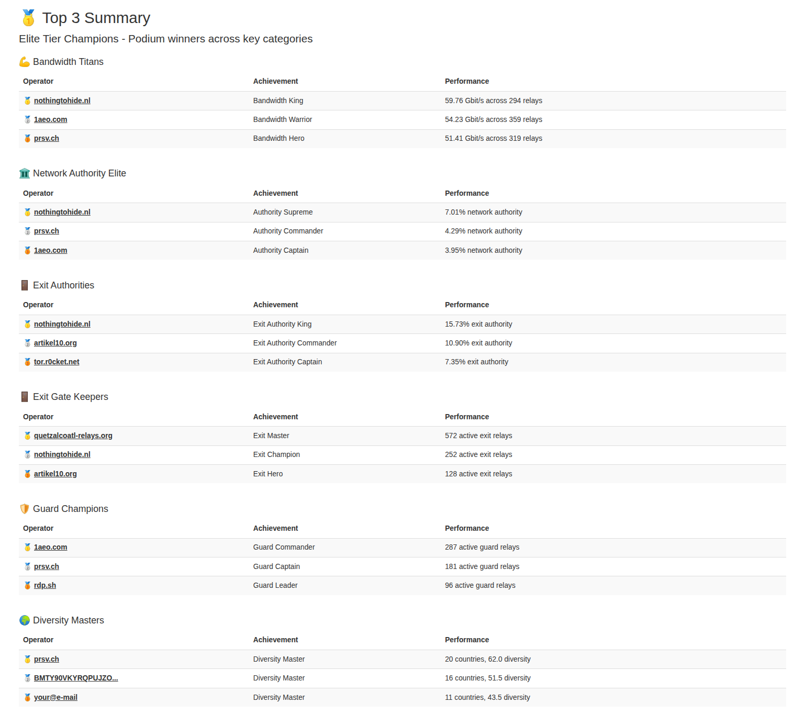
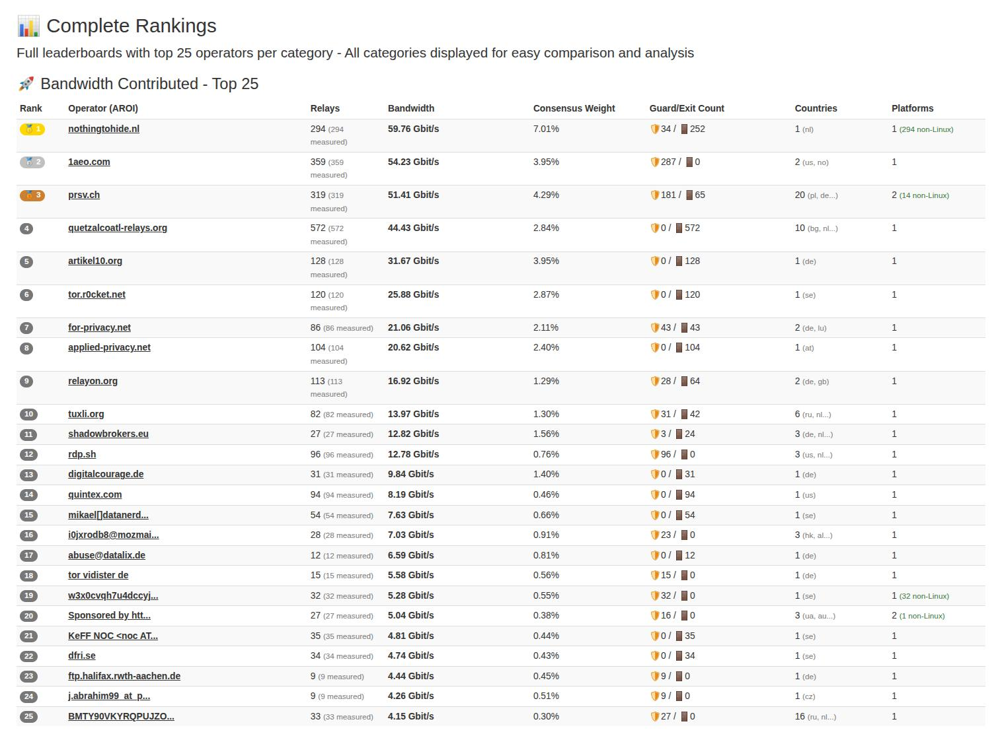
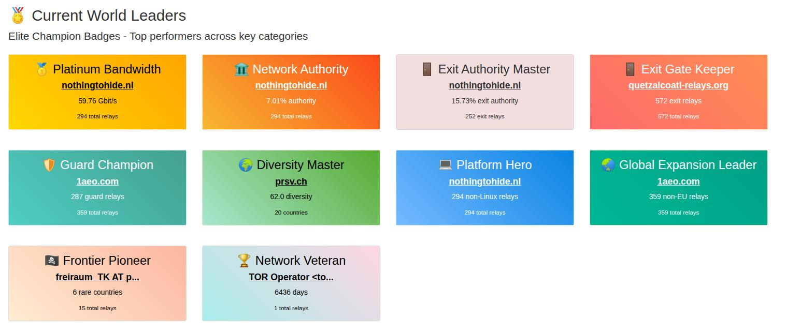
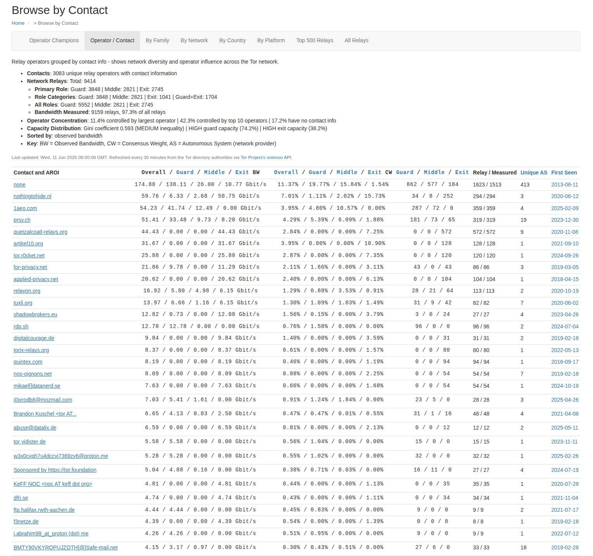
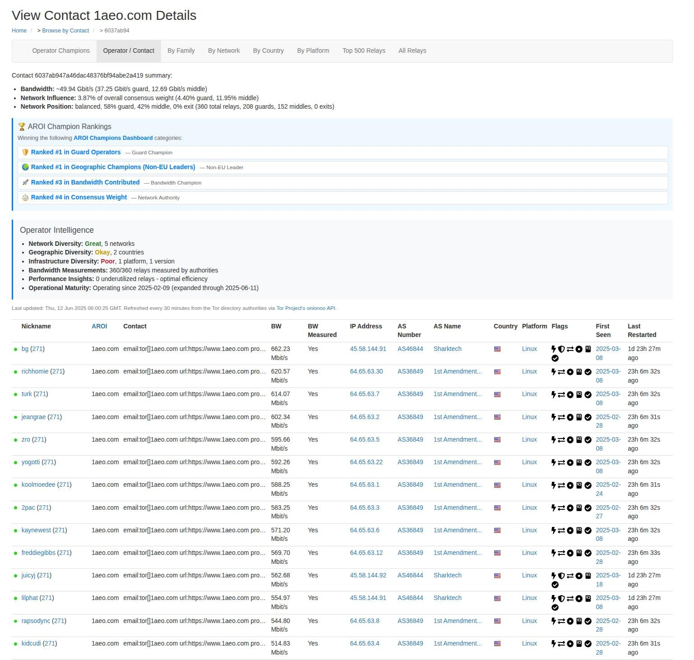

# Allium

[](https://github.com/1aeo/allium/actions)

**Advanced Tor Relay Analytics & Metrics Platform** - A powerful, security-hardened static site generator that creates comprehensive Tor relay metrics, statistics, and operator leaderboards from Onionoo API data.

## 🚀 Quick Start

**One-command setup** (recommended):
```bash
curl -sSL https://raw.githubusercontent.com/1aeo/allium/master/setup.sh | bash
```

**Manual installation**:
```bash
git clone https://github.com/1aeo/allium.git && cd allium
pip3 install -r config/requirements.txt
cd allium && python3 allium.py --progress
cd www && python3 -m http.server 8000
# Visit http://localhost:8000
```

**⚡ Update data**: `cd allium && python3 allium.py --progress`

## 🚀 Key Features

### Core Analytics
- **Complete relay metrics** with advanced sorting and filtering
- **Geographic distribution analysis** with rare country intelligence
- **Platform and AS diversity tracking** across the network
- **Bandwidth and consensus weight analytics** with multiple viewing modes

### Enhanced User Interface 🎨
- **Optimized contact pages** with efficient two-column layout (50% space reduction)
- **Enhanced operator profiles** with streamlined reliability metrics and network uptime percentiles
- **Network uptime percentile analysis** showing operator positioning within network performance distribution
- **Improved information density** while preserving all analytical data
- **Responsive design** with mobile-friendly layouts
- **JavaScript-free pagination** for AROI leaderboards with independent category navigation

### AROI Leaderboard System 🏆
- **12 specialized leaderboards** for authenticated relay operators
- **Paginated rankings** with 1-10, 11-20, 21-25 views per category for improved navigation
- **Independent pagination** - each category manages its own page state
- **CSS-only navigation** using `:target` selectors for maximum security and performance
- **Reliability scoring system** with 6-month and 5-year average uptime analysis
- **Simplified reliability scoring** using average uptime (no bandwidth weighting)
- **25+ relay eligibility filter** ensuring statistical significance for reliability categories
- **Operator achievement tracking** across multiple dimensions
- **Geographic diversity scoring** with frontier country recognition
- **Platform diversity metrics** highlighting technical leadership

### Security & Performance 🔒
- **XSS-hardened templates** with comprehensive input sanitization
- **Static generation** for maximum performance and security
- **Memory-efficient processing** with real-time monitoring
- **Parallel API fetching** (27s vs 31s sequential)
- **Template optimization** with logic moved from Jinja2 to Python for better performance
- **Pre-computed display data** reducing template rendering complexity

### Intelligence Features 🧠
- **Dynamic classification system** replacing hardcoded country lists
- **Multi-factor analysis** (relay count, network %, geopolitical factors)
- **Tier-based country rankings** (Legendary, Epic, Rare, Emerging, Common)
- **Geopolitical awareness** in country scoring algorithms
- **Performance efficiency analysis** with CW/BW ratio calculations, network comparisons, and percentile rankings
- **Underutilized relay detection** identifying optimization opportunities for operators

## 🌐 API Data Sources

allium integrates with multiple Tor Project APIs:

### Onionoo Details API
- **URL**: `https://onionoo.torproject.org/details`
- **Purpose**: Core relay information (bandwidth, flags, location, technical details)
- **Memory Usage**: ~400MB during processing
- **Usage**: Primary data source for relay listings, geographic analysis, operator metrics

**Sample Data**:
```json
{
  "relays": [{
    "fingerprint": "9695DFC35FFEB861329B9F1AB04C46397020CE31",
    "nickname": "moria1",
    "running": true,
    "flags": ["Authority", "Fast", "Running", "Stable"],
    "consensus_weight": 27,
    "country": "us",
    "platform": "Tor 0.4.8.7 on Linux",
    "observed_bandwidth": 20971520
  }]
}
```

### Onionoo Uptime API  
- **URL**: `https://onionoo.torproject.org/uptime`
- **Purpose**: Historical uptime statistics and flag history for reliability analysis
- **Memory Usage**: ~2GB during processing (large historical dataset)
- **Usage**: Enhanced relay reliability metrics and performance analysis

**Sample Data**:
```json
{
  "relays": [{
    "fingerprint": "9695DFC35FFEB861329B9F1AB04C46397020CE31",
    "uptime": {
      "1_month": "978",
      "1_year": "945"
    },
    "flags": {
      "Running": {"1_month": "987", "1_year": "954"},
      "Guard": {"1_month": "974", "1_year": "943"}
    }
  }]
}
```

**Performance Features**: Parallel API fetching, HTTP conditional requests, graceful fallback to cached data

## 📋 Usage & Configuration

```bash
./allium.py [options]
```

| Option | Default | Description |
|--------|---------|-------------|
| `--out` | `./www` | Output directory for generated files |
| `--onionoo-url` | `https://onionoo.torproject.org/details` | Onionoo API endpoint |
| `--display-bandwidth-units` | `bits` | Units for bandwidth display (`bits` or `bytes`) |
| `--progress` | `false` | Show detailed progress with memory usage |

**Examples**:
```bash
# Generate with progress tracking
./allium.py --progress

# Custom output with bytes units
./allium.py --out /var/www/tor-metrics --display-bandwidth-units bytes
```

## 📊 Generated Content

### Main Analytics
- **Index page** - Top 500 relays by consensus weight
- **Complete relay listing** - All active relays with filtering
- **AROI leaderboards** - 12 specialized operator categories
- **Geographic analysis** - Rare country intelligence

### Categorized Views
- **By Country** - Rare/frontier country analysis
- **By Platform** - OS and version distributions  
- **By AS Number** - Autonomous system diversity
- **By Contact** - Operator family groupings
- **By Bandwidth/Weight** - Multiple sorting options

### Individual Pages
- **Per-relay details** - Complete technical specifications
- **Operator profiles** - Achievement metrics and diversity scoring
- **Geographic summaries** - Country-level statistics

## 🌍 AROI Leaderboards

Twelve specialized categories tracking authenticated operator achievements:

1. **Bandwidth Champions** - Total bandwidth contributed
2. **Consensus Weight Leaders** - Network authority holders
3. **Exit Authority Champions** - Exit traffic facilitators
4. **Exit Gate Keepers** - Number of exit relays operated
5. **Guard Champions** - Number of guard relays operated
6. **Most Diverse Operators** - Geographic, platform, and network diversity
7. **Platform Diversity Heroes** - Non-Linux champions promoting OS diversity
8. **Non-EU Leaders** - Geographic champions expanding Tor outside EU
9. **Frontier Builders** - Operators in rare/underrepresented countries
10. **Network Veterans** - Longest-serving operators
11. **Reliability Masters** - 6-month average uptime champions (25+ relays)
12. **Legacy Titans** - 5-year average uptime champions (25+ relays)

## 🔒 Security & Performance

- **Global XSS protection** via Jinja2 autoescape
- **Input sanitization** for all external data sources
- **Static generation** eliminating server-side vulnerabilities  
- **No JavaScript dependencies** for maximum security
- **Real-time memory usage tracking** during generation
- **Optimized template rendering** with security hardening
- **Scalable architecture** supporting large relay counts

## 🛠️ Requirements

- **Python 3.8+**
- **Jinja2 ≥2.11.2**

## 🤝 Contributing

Contributions welcome in:
- Security enhancements and vulnerability reporting
- Analytics improvements and new leaderboard categories
- Geographic intelligence and country classification updates
- Performance optimizations and memory efficiency
- Template improvements and UI enhancements

## 📷 Screenshots

### AROI Leaderboard - Top 3 and Top 6 Champions


Main AROI leaderboard showing top operators across categories with expandable views highlighting achievements in bandwidth, consensus weight, and network diversity.

### AROI Leaderboard - Top 25 Bandwidth Champions


Detailed ranking of the top 25 bandwidth contributors showing authenticated relay operators with precise measurements and network impact metrics.

### AROI Leaderboard - Champions Badges


Achievement badge system displaying operator accomplishments including geographic diversity, platform diversity, frontier building, and network veteran status.

### Browse by Contact


Contact-based interface for exploring relay operators grouped by contact information, enabling easy navigation of operator families and collective contributions.

### Browse by Contact - 1aeo Example


Individual operator profile showing relay family details, geographic distribution, and technical specifications across their network infrastructure.

## 📄 License

**UNLICENSE** (public domain)

**Third-Party Assets**: Country flags (GoSquared), Relay flags (The Tor Project)

## 🔗 References

- [Original allium](https://git.jordan.im/allium) - Fork source
- [Tor Metrics Project](https://metrics.torproject.org/) - Official metrics (inspiration)
- [Onionoo API](https://onionoo.torproject.org/) - Tor relay data source
- [Tor Project](https://www.torproject.org/) - Privacy and anonymity network

---

**allium** - Empowering Tor network analysis with intelligence, security, and performance.
