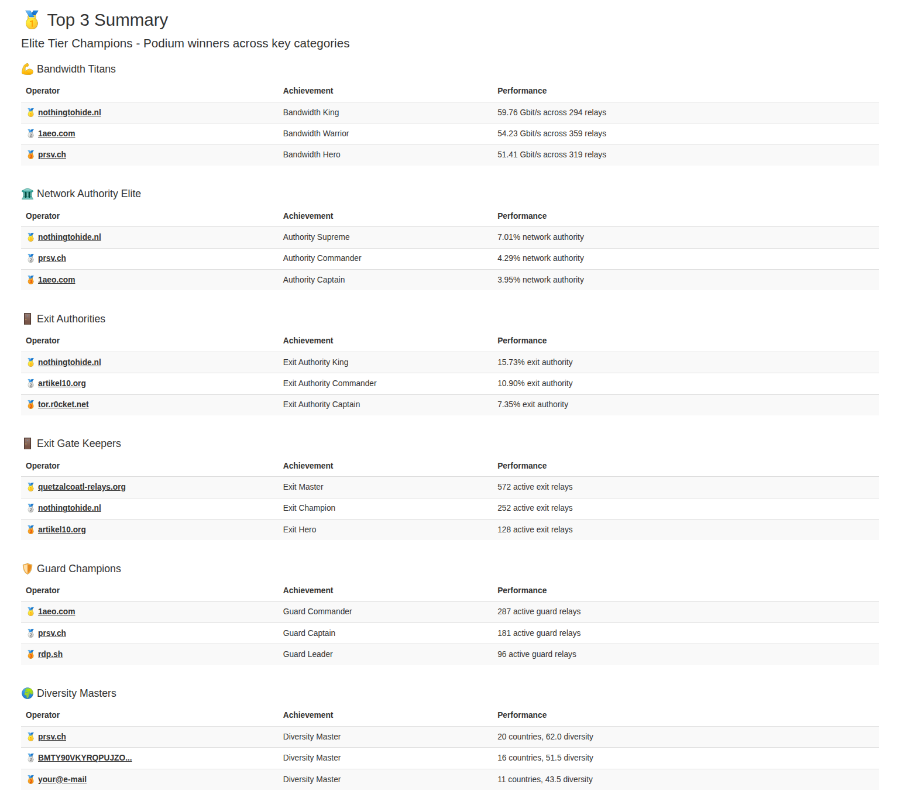
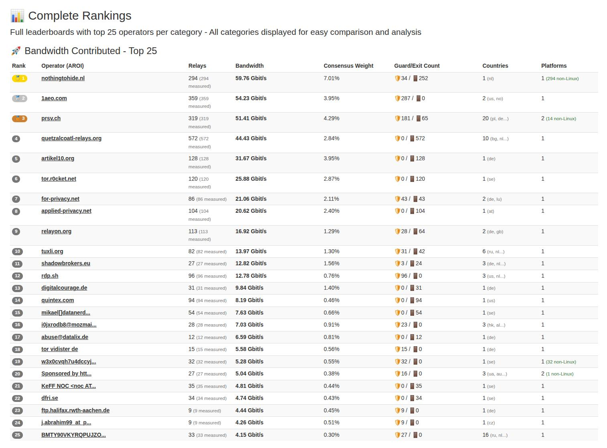
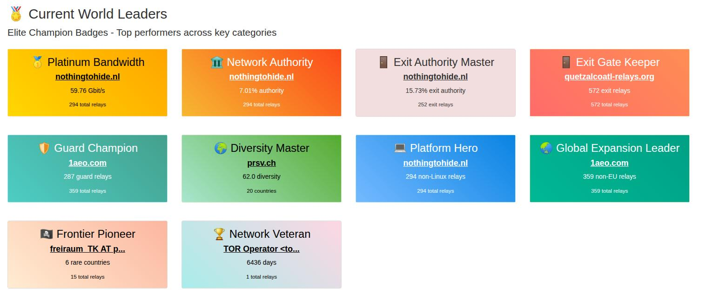
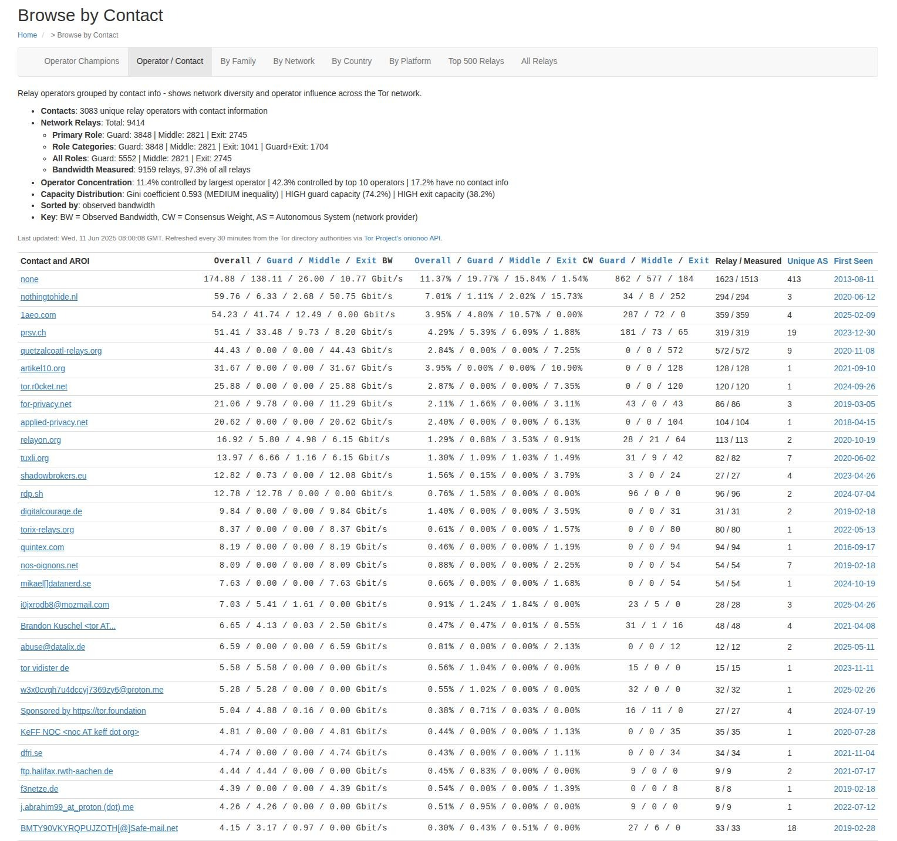
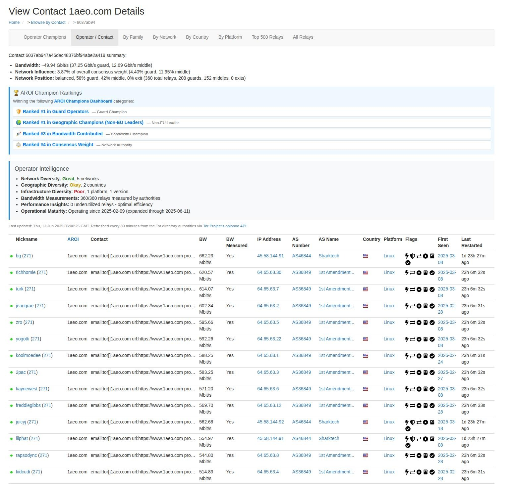

# Allium

[](https://github.com/1aeo/allium/actions)

**Advanced Tor Relay Analytics & Metrics Platform** - A powerful, security-hardened static site generator that creates comprehensive Tor relay metrics, statistics, and operator leaderboards from Onionoo API data.

## 🚀 Quick Start
**One-command setup** (recommended):
```bash
curl -sSL https://raw.githubusercontent.com/1aeo/allium/master/setup.sh | bash
```

**Manual installation**:
```bash
git clone https://github.com/1aeo/allium.git && cd allium
python3 -m venv venv
source venv/bin/activate
python -m pip install -r config/requirements.txt
python3 allium/allium.py --progress --apis details
cd www && python3 -m http.server 8000
# Visit http://localhost:8000
```

**⚡ Update data**: `python3 allium/allium.py --progress`

## 📋 Table of Contents

- [🚀 Key Features](#-key-features)
- [🌐 API Data Sources](#-api-data-sources)  
- [📋 Usage & Configuration](#-usage--configuration)
- [📊 Generated Content](#-generated-content)
- [🌍 AROI Leaderboards](#-aroi-leaderboards)
- [🔒 Security & Performance](#-security--performance)
- [🛠️ Requirements](#️-requirements)
- [📚 Documentation](#-documentation)
- [🤝 Contributing](#-contributing)
- [📷 Screenshots](#-screenshots)
- [📄 License](#-license)

## 🚀 Key Features

### Core Analytics
- **Complete relay metrics** with advanced sorting and filtering
- **Geographic distribution analysis** with rare country intelligence
- **Platform and AS diversity tracking** across the network
- **Bandwidth and consensus weight analytics** with multiple viewing modes

### Complete Uptime Intelligence System ⏰
- **Reliability Champions Leaderboard** with "Reliability Masters" (6-month) & "Legacy Titans" (5-year) categories
- **Comprehensive operator reliability portfolios** with multi-period analysis and network percentile positioning
- **Flag-specific uptime tracking** with intelligent priority system (Exit > Guard > Fast > Running)
- **Statistical outlier detection** identifying performance anomalies and optimization opportunities (≥2σ deviations)
- **Network Health Dashboard** with real-time uptime metrics and concentration risk analysis
- **Individual relay uptime display** with flag analysis and network context

### Enhanced User Interface 🎨
- **Optimized contact pages** with streamlined reliability metrics and comprehensive analysis
- **Enhanced family pages** with AROI and Contact navigation
- **Country display improvements** with full country names and tooltips
- **Responsive design** with mobile-friendly layouts
- **JavaScript-free pagination** for AROI leaderboards with independent category navigation

### AROI Leaderboard System 🏆
- **17 specialized leaderboards** for authenticated relay operators across all performance dimensions
- **Champion badge system** with elite performer recognition across categories
- **Paginated rankings** with 1-10, 11-20, 21-25 views per category for optimal navigation
- **Independent pagination** - each category manages its own page state with CSS-only navigation
- **Reliability scoring system** with 6-month and 5-year average uptime analysis
- **Bandwidth served analysis** with historical performance tracking
- **25+ relay eligibility filter** ensuring statistical significance for reliability categories
- **Multi-dimensional scoring** across capacity, diversity, reliability, and innovation
- **Geographic diversity scoring** with frontier country recognition and non-EU leadership
- **Platform diversity metrics** highlighting technical leadership beyond Linux
- **Network address diversity** with IPv4/IPv6 unique address distribution tracking
- **Veteran recognition** with scale-weighted tenure analysis

### Security & Performance 🔒
- **XSS-hardened templates** with comprehensive input sanitization
- **Static generation** for maximum performance and security
- **Memory-efficient processing** with real-time monitoring
- **Parallel API fetching** (27s vs 31s sequential)
- **Template optimization** with logic moved from Jinja2 to Python for better performance
- **Pre-computed display data** reducing template rendering complexity

### Network Health Dashboard 📊
- **Comprehensive network monitoring** with 10-card dashboard layout
- **Real-time network metrics** including relay counts, bandwidth stats, uptime analysis
- **IPv6 adoption tracking** at relay, operator, and network levels
- **Geographic and provider diversity** with concentration risk analysis
- **Performance analytics** with CW/BW ratio calculations and percentile rankings

### Directory Authorities Monitoring 🏛️
- **Authority health tracking** with uptime statistics and Z-score outlier detection
- **Network consensus monitoring** displaying authority status, geographic distribution, and performance metrics

### Intelligence Features 🧠
- **6-layer intelligence engine** with sub-millisecond analysis performance
- **Context analysis** with automatic relationship mapping and pattern detection
- **Performance correlation analysis** with CW/BW ratio intelligence and network benchmarking
- **Geographic intelligence** with concentration risk analysis and jurisdiction mapping
- **Infrastructure intelligence** with AS concentration and provider diversity assessment
- **Statistical intelligence** with network percentiles and outlier detection
- **22 template integration points** across contact pages, health dashboard, and relay info
- **Dynamic classification system** with tier-based country rankings
- **Underutilized relay detection** identifying optimization opportunities for operators

## 🌐 API Data Sources

allium integrates with multiple Tor Project APIs:

### Onionoo Details API
- **URL**: `https://onionoo.torproject.org/details`
- **Purpose**: Core relay information (bandwidth, flags, location, technical details)
- **Memory Usage**: ~400MB during processing
- **Usage**: Primary data source for relay listings, geographic analysis, operator metrics

**Sample Data**:
```json
{
  "relays": [{
    "fingerprint": "9695DFC35FFEB861329B9F1AB04C46397020CE31",
    "nickname": "moria1",
    "running": true,
    "flags": ["Authority", "Fast", "Running", "Stable"],
    "consensus_weight": 27,
    "country": "us",
    "platform": "Tor 0.4.8.7 on Linux",
    "observed_bandwidth": 20971520
  }]
}
```

### Onionoo Uptime API  
- **URL**: `https://onionoo.torproject.org/uptime`
- **Purpose**: Historical uptime statistics and flag history for reliability analysis
- **Memory Usage**: ~2GB during processing (large historical dataset)
- **Usage**: Enhanced relay reliability metrics and performance analysis

### Onionoo Bandwidth API
- **URL**: `https://onionoo.torproject.org/bandwidth`
- **Purpose**: Historical bandwidth statistics for trend analysis and optimization
- **Cache**: Configurable cache time (default: 12 hours)
- **Usage**: Historical bandwidth data for performance tracking and analysis

**Sample Data**:
```json
{
  "relays": [{
    "fingerprint": "9695DFC35FFEB861329B9F1AB04C46397020CE31",
    "uptime": {
      "1_month": "978",
      "1_year": "945"
    },
    "flags": {
      "Running": {"1_month": "987", "1_year": "954"},
      "Guard": {"1_month": "974", "1_year": "943"}
    }
  }]
}
```

**Performance Features**: Parallel API fetching, HTTP conditional requests, graceful fallback to cached data

## 📋 Usage & Configuration

```bash
./allium.py [options]
```

| Option | Default | Description |
|--------|---------|-------------|
| `--out` | `./www` | Output directory for generated files |
| `--onionoo-url` | `https://onionoo.torproject.org/details` | Onionoo API endpoint |
| `--onionoo-bandwidth-url` | `https://onionoo.torproject.org/bandwidth` | Historical bandwidth API endpoint |
| `--bandwidth-cache-hours` | `12` | Cache time for historical bandwidth data (hours) |
| `--display-bandwidth-units` | `bits` | Units for bandwidth display (`bits` or `bytes`) |
| `--progress` | `false` | Show detailed progress with memory usage |

**Examples**:
```bash
# Generate with progress tracking
./allium.py --progress

# Custom output with bytes units
./allium.py --out /var/www/tor-metrics --display-bandwidth-units bytes
```

## 📊 Generated Content

### Main Analytics
- **Index page** - Top 500 relays by consensus weight
- **Complete relay listing** - All active relays with filtering
- **AROI leaderboards** - 17 specialized operator categories
- **Geographic analysis** - Rare country intelligence

### Categorized Views
- **By Country** - Rare/frontier country analysis
- **By Platform** - OS and version distributions  
- **By AS Number** - Autonomous system diversity
- **By Contact** - Operator family groupings
- **By Bandwidth/Weight** - Multiple sorting options

### Individual Pages
- **Per-relay details** - Complete technical specifications
- **Operator profiles** - Achievement metrics and diversity scoring
- **Geographic summaries** - Country-level statistics
- **Network Health Dashboard** - Real-time network monitoring and analysis
- **Directory Authorities** - Consensus health tracking with uptime analysis and version compliance monitoring

## 🌍 AROI Leaderboards

Seventeen specialized categories tracking authenticated operator achievements across five core dimensions:

**🚀 Capacity & Performance**  
1. **Bandwidth Contributed** - Total observed bandwidth capacity  
2. **Consensus Weight Authority** - Network routing control influence

**🛡️ Network Role Specialization**  
3. **Exit Authority Champions** - Exit consensus weight control  
4. **Guard Authority Champions** - Guard consensus weight control  
5. **Exit Operators** - Exit relay infrastructure providers  
6. **Guard Operators** - Guard relay infrastructure providers

**⏰ Reliability & Performance Excellence**  
7. **Reliability Masters** - 6-month average uptime (25+ relays)  
8. **Legacy Titans** - 5-year average uptime (25+ relays)

**🌍 Diversity & Geographic Leadership**  
9. **Most Diverse Operators** - Multi-factor diversity scoring  
10. **Platform Diversity Heroes** - Non-Linux operational excellence  
11. **Non-EU Leaders** - Geographic expansion beyond EU  
12. **Frontier Builders** - Operations in underrepresented countries

**🏆 Innovation & Leadership**  
13. **Network Veterans** - Scale-weighted operational tenure  
14. **IPv4 Address Leaders** - Unique IPv4 address diversity  
15. **IPv6 Address Leaders** - Unique IPv6 address diversity

**📊 Bandwidth Performance Excellence**  
16. **Bandwidth Served Masters** - 6-month bandwidth performance (25+ relays)  
17. **Bandwidth Served Legends** - 5-year bandwidth performance (25+ relays)

## 🔒 Security & Performance

- **Global XSS protection** via Jinja2 autoescape
- **Input sanitization** for all external data sources
- **Static generation** eliminating server-side vulnerabilities  
- **No JavaScript dependencies** for maximum security
- **Real-time memory usage tracking** during generation
- **Optimized template rendering** with security hardening
- **Scalable architecture** supporting large relay counts

## 🛠️ Requirements

### Production (Minimal)
- **Python 3.8+**
- **Jinja2 ≥2.11.2**

### Development (Additional)
- **pytest ≥6.0.0** - Unit testing framework
- **pytest-cov ≥2.10.0** - Coverage reporting
- **flake8 ≥3.8.0** - Code style checker
- **bandit ≥1.7.0** - Security vulnerability scanner
- **safety ≥1.10.0** - Dependency vulnerability checker
- **djlint ≥1.0.0** - HTML/template linter
- **memory-profiler ≥0.60.0** - Memory usage profiling

## 📚 Documentation

Comprehensive documentation is available in the [`docs/`](docs/) directory:

### 👥 For Users
- **[Quick Start Guide](docs/user-guide/quick-start.md)** - Get running in 5 minutes
- **[Configuration Guide](docs/user-guide/configuration.md)** - All options and automation setup
- **[Updating Guide](docs/user-guide/updating.md)** - Keep data and code current
- **[Features Guide](docs/user-guide/features.md)** - Understanding all 17 AROI categories and features

### 👨‍💻 For Developers
- **[Development Guide](docs/development/README.md)** - Contributing and development setup
- **[Testing Standards](docs/development/testing.md)** - Test naming and organization
- **[Performance Guide](docs/development/performance.md)** - Current status and optimization
- **[Security Guide](docs/development/security.md)** - Security best practices

### 📖 Additional Resources
- **[Complete Documentation Index](docs/README.md)** - Full documentation navigation
- **[Roadmap 2025-2026](docs/ROADMAP.md)** - Future plans and milestones
- **[Architecture Overview](docs/architecture/README.md)** - System design
- **[Implemented Features](docs/features/implemented/)** - What works now
- **[Planned Features](docs/features/planned/)** - What's coming next

## 🤝 Contributing

Contributions welcome! See [CONTRIBUTING.md](CONTRIBUTING.md) for detailed setup instructions.

### 🧪 Developer Setup

**Quick developer setup** (includes testing and linting tools):
```bash
curl -sSL https://raw.githubusercontent.com/1aeo/allium/master/setup.sh | bash -s -- --dev
```

**Manual developer setup**:
```bash
git clone https://github.com/1aeo/allium.git && cd allium
python3 -m venv venv && source venv/bin/activate
pip install -r config/requirements-dev.txt
python3 allium/allium.py --progress
```

**Run tests**: `pytest` • **Lint code**: `flake8 .` • **Security scan**: `bandit -r .`

### 🎯 Contributing Areas

Areas where contributions are particularly welcome:
- Security enhancements and vulnerability reporting
- Analytics improvements and new leaderboard categories
- Geographic intelligence and country classification updates
- Performance optimizations and memory efficiency
- Template improvements and UI enhancements

## 📷 Screenshots

### AROI Leaderboard - Top 3 and Top 6 Champions


Main AROI leaderboard showing top operators across categories with expandable views highlighting achievements in bandwidth, consensus weight, and network diversity.

### AROI Leaderboard - Top 25 Bandwidth Capacity Champions


Detailed ranking of the top 25 bandwidth contributors showing authenticated relay operators with precise measurements and network impact metrics.

### AROI Leaderboard - Champions Badges


Achievement badge system displaying operator accomplishments including geographic diversity, platform diversity, frontier building, and network veteran status.

### Browse by Contact


Contact-based interface for exploring relay operators grouped by contact information, enabling easy navigation of operator families and collective contributions.

### Browse by Contact - 1aeo Example


Individual operator profile showing relay family details, geographic distribution, and technical specifications across their network infrastructure.

## 📄 License

**UNLICENSE** (public domain)

**Third-Party Assets**: Country flags (GoSquared), Relay flags (The Tor Project)

## 🔗 References

- [Original allium](https://git.jordan.im/allium) - Fork source
- [Tor Metrics Project](https://metrics.torproject.org/) - Official metrics (inspiration)
- [Onionoo API](https://onionoo.torproject.org/) - Tor relay data source
- [Tor Project](https://www.torproject.org/) - Privacy and anonymity network

---

**allium** - Empowering Tor network analysis with intelligence, security, and performance.
