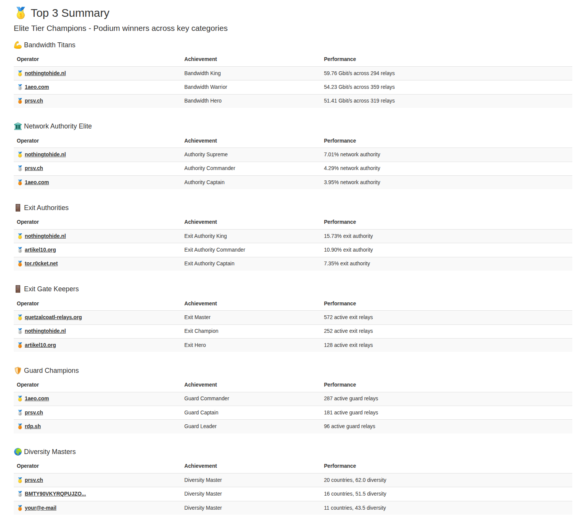
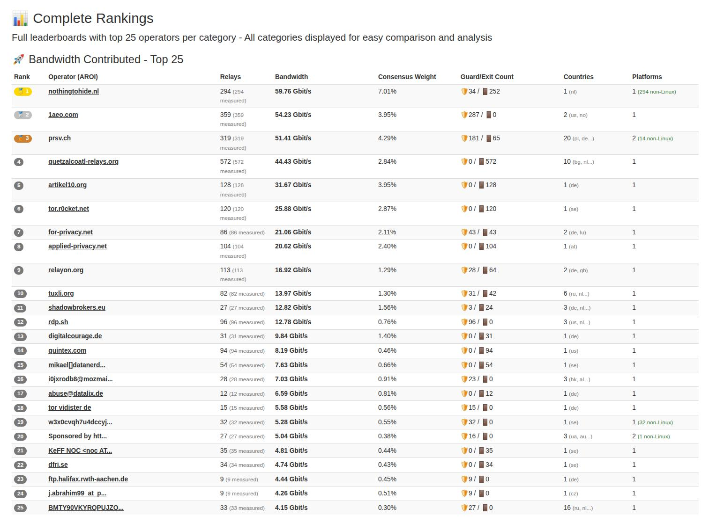
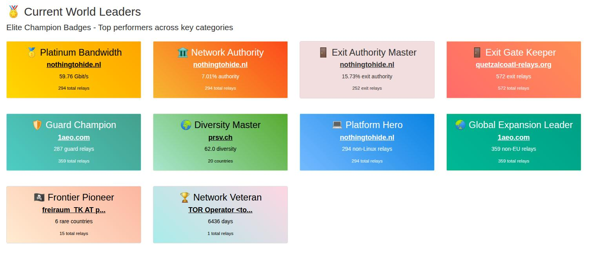
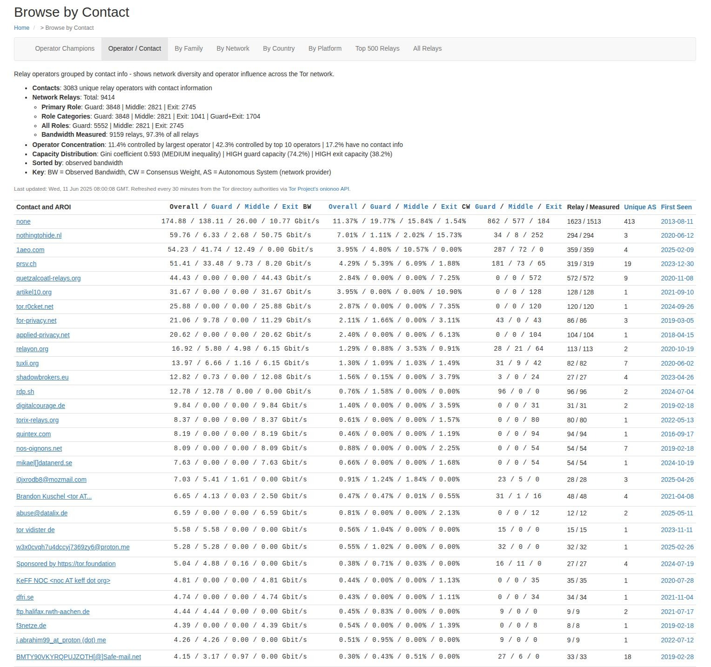
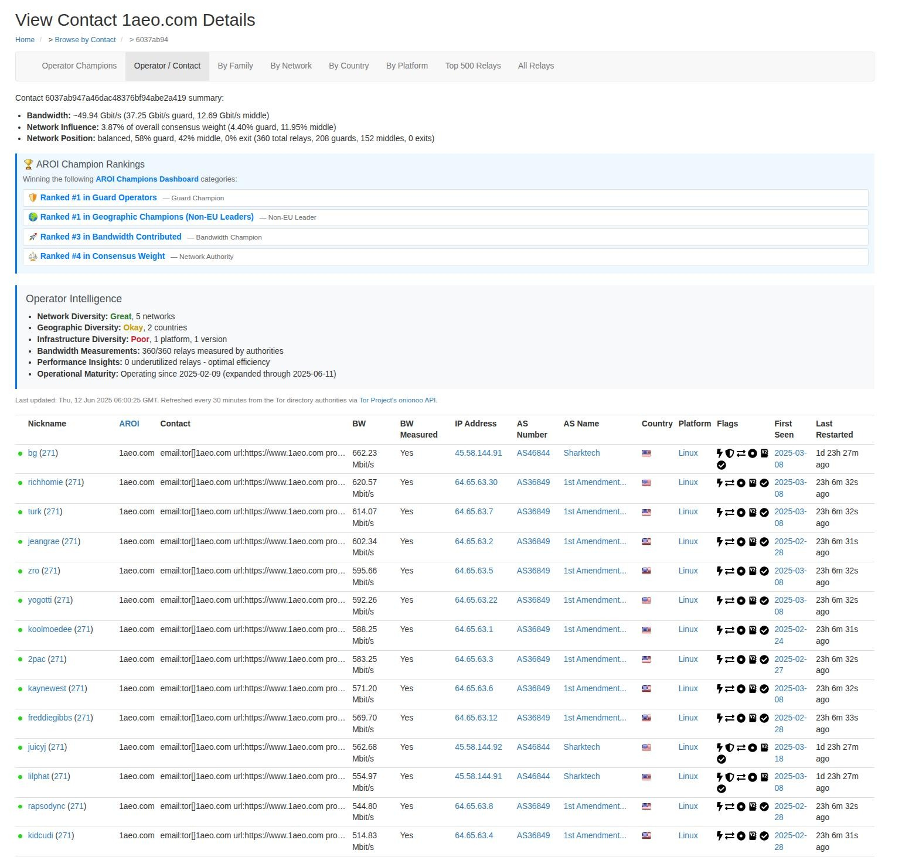

# Allium

[](https://github.com/1aeo/allium/actions)
[](https://www.python.org/downloads/)
[](https://unlicense.org/)

**Advanced Tor Relay Analytics & Metrics Platform** — a security-hardened static site generator that produces a browsable Tor relay analytics site from Onionoo API data.

### What You Get

- **Static site output** in `allium/www/` — serve locally or deploy anywhere static files can be hosted
- **Relay + operator analytics** — bandwidth, consensus weight, diversity views, uptime/reliability, and more
- **AROI leaderboards** — 21 specialized categories recognizing authenticated relay operators

### Why Allium?

- **Privacy-First** — Generates static HTML requiring no server-side processing or JavaScript dependencies
- **Security-Hardened** — Input sanitization, XSS protection, and dependency scanning built-in
- **Deep Intelligence** — Goes beyond basic metrics with operator leaderboards and 6-layer analytics engine

*Originally forked from [allium](https://git.jordan.im/allium), this version adds extensive analytics, operator leaderboards, and intelligence features.*



## Quick Start

### One-command setup (recommended)

```bash
curl -sSL https://raw.githubusercontent.com/1aeo/allium/master/setup.sh | bash
```

### Safer install (inspect script first)

```bash
curl -fsSL https://raw.githubusercontent.com/1aeo/allium/master/setup.sh -o setup.sh
less setup.sh
bash setup.sh
```

### Manual installation

```bash
git clone https://github.com/1aeo/allium.git && cd allium

# Create and activate virtual environment (recommended)
python3 -m venv venv
source venv/bin/activate  # On Windows: venv\Scripts\activate

pip install -r config/requirements.txt
cd allium && python3 allium.py --progress
cd www && python3 -m http.server 8000
# Visit http://localhost:8000
```

### Common Tasks

| Task | Command |
|------|---------|
| Generate site | `cd allium && python3 allium.py --progress` |
| Serve output | `cd allium/www && python3 -m http.server 8000` |
| Custom output dir | `python3 allium.py --out /path/to/site` |
| Minimal memory mode | `python3 allium.py --apis details --progress` |

### Resource Notes

- **Memory**: Plan for **~3GB RAM** available (the uptime dataset alone peaks around ~2GB)
- **Time**: Full generation takes ~2-5 minutes producing ~21,700 HTML pages
- **Disk**: Output is approximately ~500MB

📖 **[Full Quick Start Guide](docs/user-guide/quick-start.md)** — detailed setup instructions, troubleshooting, and deployment options.

## Table of Contents

- [Key Features](#key-features)
- [Usage & Configuration](#usage--configuration)
- [API Data Sources](#api-data-sources)
- [Security & Performance](#security--performance)
- [Requirements](#requirements)
- [Documentation](#documentation)
- [Contributing](#contributing)
- [Screenshots](#screenshots)
- [License](#license)
- [References](#references)

## Key Features

<details>
<summary><strong>Data Processing</strong></summary>

- Multi-threaded API fetching from 5 sources: Onionoo Details/Uptime/Bandwidth, AROI Validation, CollecTor Consensus
- Multiprocessing page generation (configurable via `--workers`)
- Downtime filtering: excludes relays offline >7 days (configurable via `--filter-downtime`)
- Generates relay, contact, country, AS, family, platform, and flag pages

</details>

<details>
<summary><strong>AROI Leaderboards (21 Categories)</strong></summary>

Authenticated Relay Operator Identification system ranking verified operators:

**Capacity**: Bandwidth Contributed, Consensus Weight Leaders, Total Data Transferred Champions (5yr)  
**Roles**: Exit/Guard Authority Champions, Exit/Guard Operators  
**Reliability**: Reliability Masters (6mo), Legacy Titans (5yr), Bandwidth Served Masters (6mo), Bandwidth Served Legends (5yr)  
**Diversity** (two co-equal boards per dimension — Volume = scale of non-dominant contribution, Breadth = distinct spread within one operator): Diversity All-Rounders (overall), Non-Linux Powerhouses (platform volume), OS Polyglots (platform breadth, 2+ distinct OSes incl. Linux), Global Powerhouses (non-EU volume), Jurisdiction Globetrotters (non-EU breadth), Frontier Builders (rare-country breadth)  
**Infrastructure**: Network Veterans (tenure), IPv4/IPv6 Address Leaders, AROI Validation Champions (with v2/v3 split columns + tiered migration badges 🔍/🔁/🚀/🏆)

- Paginated rankings (Top 10, 11-20, 21-25) with CSS-only navigation
- Champion badge system for top performers
- Dual CIISS spec support: tracks both ciissversion:2 (RSA-fingerprint proofs) and ciissversion:3 (ed25519 happy-family proofs) with operator-level migration tier classification

</details>

<details>
<summary><strong>Reliability System</strong></summary>

- Multi-period uptime tracking: 1-month, 6-month, 1-year, 5-year
- Flag-specific uptime with priority: Exit > Guard > Fast > Running
- Network percentile positioning (5th, 25th, 50th, 75th, 90th, 95th, 99th)
- Statistical outlier detection using ≥2σ standard deviation threshold
- Uptime normalization from Onionoo 0-999 scale to 0-100%
- Minimum 30 data points required for valid calculations

</details>

<details>
<summary><strong>Network Health Dashboard</strong></summary>

Real-time metrics at `network-health.html`:

- Relay counts by role (exit/guard/middle) with percentages
- Bandwidth distribution (total, by role, mean/median per category)
- Uptime statistics (1mo mean/median by role, multi-period series)
- AROI validation status (CIISS spec v2 + v3 dual-spec): per-version success rates, ciissversion adoption, peer-issue alerts (🚨 leaked-key incidents, ⏳ pending Onionoo refresh)
- IPv4/IPv6 adoption rates
- Flag distribution (Fast, Stable, HSDir, V2Dir, Authority)
- New relay tracking (24h, 30d, 6mo, 1yr)

</details>

<details>
<summary><strong>Intelligence Engine (6 Layers)</strong></summary>

Pre-computed analysis attached to contact pages:

1. **Basic Relationships** — total countries, networks, operators, families, platforms
2. **Concentration Patterns** — top-3 country/AS weight, Five Eyes percentage, no-contact percentage
3. **Performance Correlation** — measured percentage, underutilized relay detection, CW/BW efficiency ratio
4. **Infrastructure Dependency** — unique Tor versions, critical AS identification (>5% weight), sync risk assessment
5. **Geographic Clustering** — Five/Fourteen Eyes influence, regional HHI concentration index
6. **Capacity Distribution** — Gini coefficient, guard/exit capacity percentages

</details>

<details>
<summary><strong>Directory Authorities</strong></summary>

`misc/authorities.html` provides:

- Authority uptime statistics with Z-score outlier detection
- Version compliance tracking
- Consensus participation monitoring
- Geographic distribution

</details>

## Usage & Configuration

```bash
./allium.py [options]
```

| Option | Default | Description |
|--------|---------|-------------|
| `--out` | `./www` | Output directory for generated files |
| `--onionoo-url` | `https://onionoo.torproject.org/details` | Onionoo API endpoint |
| `--onionoo-bandwidth-url` | `https://onionoo.torproject.org/bandwidth` | Historical bandwidth API endpoint |
| `--bandwidth-cache-hours` | `12` | Cache time for historical bandwidth data (hours) |
| `--display-bandwidth-units` | `bits` | Units for bandwidth display (`bits` or `bytes`) |
| `--progress` | `false` | Show detailed progress with memory usage |
| `--apis` | `all` | API sources: `all` (~2.4GB) or `details` (~400MB) |
| `--filter-downtime` | `7` | Exclude relays offline >N days (0 to disable) |
| `--workers` | CPU count (min 4) | Parallel workers for page generation |

**Examples**:

```bash
# Generate with progress tracking
./allium.py --progress

# Custom output with bytes units
./allium.py --out /var/www/tor-metrics --display-bandwidth-units bytes

# Minimal memory mode (~400MB instead of ~2.4GB)
./allium.py --apis details --progress
```

## API Data Sources

Allium integrates with multiple Tor Project APIs:

### Onionoo Details API

- **URL**: `https://onionoo.torproject.org/details`
- **Purpose**: Core relay information (bandwidth, flags, location, technical details)
- **Memory**: ~400MB during processing

<details>
<summary>Sample response</summary>

```json
{
  "relays": [{
    "fingerprint": "9695DFC35FFEB861329B9F1AB04C46397020CE31",
    "nickname": "moria1",
    "running": true,
    "flags": ["Authority", "Fast", "Running", "Stable"],
    "consensus_weight": 27,
    "country": "us",
    "platform": "Tor 0.4.8.7 on Linux",
    "observed_bandwidth": 20971520
  }]
}
```

</details>

### Onionoo Uptime API

- **URL**: `https://onionoo.torproject.org/uptime`
- **Purpose**: Historical uptime statistics, flag history for reliability analysis, **and cross-check source for `first_seen` correction** (see Notable behaviour below)
- **Memory**: ~2GB during processing (large historical dataset)

<details>
<summary>Sample response</summary>

```json
{
  "relays": [{
    "fingerprint": "9695DFC35FFEB861329B9F1AB04C46397020CE31",
    "uptime": {
      "1_month": "978",
      "1_year": "945"
    },
    "flags": {
      "Running": {"1_month": "987", "1_year": "954"},
      "Guard": {"1_month": "974", "1_year": "943"}
    }
  }]
}
```

</details>

### Onionoo Bandwidth API

- **URL**: `https://onionoo.torproject.org/bandwidth`
- **Purpose**: Historical bandwidth statistics for trend analysis
- **Cache**: Configurable (default: 12 hours)

**Performance Features**: Parallel API fetching, HTTP conditional requests, graceful fallback to cached data

### Notable behaviour: first_seen correction

Allium repairs the `first_seen` field on each relay using Onionoo's
`/uptime` endpoint before page generation. This works around a long-standing
upstream Onionoo bug (issues
[#40018](https://gitlab.torproject.org/tpo/network-health/metrics/onionoo/-/issues/40018),
[#40028](https://gitlab.torproject.org/tpo/network-health/metrics/onionoo/-/issues/40028),
[#40033](https://gitlab.torproject.org/tpo/network-health/metrics/onionoo/-/issues/40033),
[#40042](https://gitlab.torproject.org/tpo/network-health/metrics/onionoo/-/issues/40042))
which periodically resets `first_seen` for large fractions of the network
after backend state-loss events. When the bug is active, a per-run summary
log line reports how many relays were repaired and the resulting
`network_mean_age_formatted` reflects the corrected (older) dates. Logic
lives in `allium/lib/first_seen_correction.py` and will be removed once
the upstream bug is fixed.

## Security & Performance

- **Global XSS protection** via Jinja2 autoescape
- **Input sanitization** for all external data sources
- **Static generation** eliminating server-side vulnerabilities
- **No JavaScript dependencies** for maximum security
- **Real-time memory usage tracking** during generation
- **Scalable architecture** supporting large relay counts

## Requirements

### Production (Minimal)

- **Python 3.8+**
- **Jinja2 ≥2.11.2**

### Development (Additional)

- **pytest ≥6.0.0** — Unit testing framework
- **pytest-cov ≥2.10.0** — Coverage reporting
- **flake8 ≥3.8.0** — Code style checker
- **bandit ≥1.7.0** — Security vulnerability scanner
- **safety ≥1.10.0** — Dependency vulnerability checker
- **djlint ≥1.0.0** — HTML/template linter
- **memory-profiler ≥0.60.0** — Memory usage profiling

## Documentation

Comprehensive documentation in [`docs/`](docs/):

### For Users

- **[Configuration Guide](docs/user-guide/configuration.md)** — All options and automation setup
- **[Deployment Guide](docs/user-guide/deployment.md)** — Web server setup
- **[Troubleshooting](docs/user-guide/troubleshooting.md)** — Common issues and solutions

### For Developers

- **[Architecture Overview](docs/architecture/overview.md)** — System design and data flow
- **[Testing Standards](docs/development/testing.md)** — Test naming and organization
- **[Security Guide](docs/development/security.md)** — Security best practices

### Additional Resources

- **[Documentation Index](docs/README.md)** — Full navigation
- **[Roadmap 2025-2026](docs/features/planned/allium-roadmap-2025.md)** — Future plans
- **[Current Capabilities](docs/reference/current-capabilities.md)** — All working features
- **[Planned Features](docs/features/planned/)** — What's coming next

## Contributing

Contributions welcome! See [CONTRIBUTING.md](CONTRIBUTING.md) for detailed instructions.

### Developer Setup

Follow [Quick Start](#quick-start), then install dev dependencies:

```bash
pip install -r config/requirements-dev.txt
```

**Run tests**: `pytest` • **Lint**: `flake8 .` • **Security scan**: `bandit -r .`

### Contributing Areas

- Security enhancements and vulnerability reporting
- Analytics improvements and new leaderboard categories
- Geographic intelligence and country classification updates
- Performance optimizations and memory efficiency
- Template improvements and UI enhancements

## Screenshots

### AROI Leaderboard — Top 3 and Top 6 Champions


Main AROI leaderboard showing top operators across categories with expandable views.

### AROI Leaderboard — Top 25 Bandwidth Champions



Detailed ranking of top bandwidth contributors with network impact metrics.

### AROI Leaderboard — Champions Badges



Achievement badge system displaying operator accomplishments.

### Browse by Contact



Contact-based interface for exploring relay operators grouped by contact information.

### Browse by Contact — 1aeo Example



Individual operator profile showing relay family details and geographic distribution.

## License

**UNLICENSE** (public domain)

**Third-Party Assets**: Country flags (GoSquared), Relay flags (The Tor Project)

## References

- [Original allium](https://git.jordan.im/allium) — Fork source
- [Tor Metrics Project](https://metrics.torproject.org/) — Official metrics (inspiration)
- [Onionoo API](https://onionoo.torproject.org/) — Tor relay data source
- [Tor Project](https://www.torproject.org/) — Privacy and anonymity network

---

**allium** — Empowering Tor network analysis with intelligence, security, and performance.
