# Relay page charts

**Audience**: Contributors
**Scope**: Time-series charts on the individual relay page (`relay-info.html`)
**Status**: Variation review — pick encodings, then implement
**Data**: Onionoo `relays_published` 2026-08-15 06:00 UTC

This is page type 1. Network-health, contact, country, and AS pages come after
the encodings here are chosen.

Mockups: [`mockups/`](mockups/). Regenerator:
[`generate_relay_page_chart_variations.py`](generate_relay_page_chart_variations.py).
Write/read band census: [`write-read-band.md`](write-read-band.md).

---

## What "same page: chart 1 and chart 3" meant

That line in [`top-10-operator-charts.md`](top-10-operator-charts.md) was
ambiguous. **Same page meant this page** — `relay-info.html` for one
fingerprint.

It proposed, after uptime and bandwidth:

1. Chart 1 (network CW vs observed-bandwidth scatter) as a small inset with
   this relay highlighted.
2. Chart 3 (network-wide Guard vs 2 MB/s histogram) as an eligibility bar.

Those two are the wrong next charts for a relay page.

- Chart 1 is a **network** chart. Rendering the same 8k-point scatter on
  ~11k relay pages wastes build time and does not help "what happened to
  *this* relay last week." A one-line percentile already exists in
  `#bandwidth` ("Consensus Weight … Nth pctl").
- Chart 3 is also a **network** chart. This page already has the right
  artifact: the `#flags` eligibility table (this relay vs authority
  thresholds). A histogram of every other relay does not answer "why did
  *I* lose Guard?"

Correct split:

| Chart from the top 10 | Relay page | Later page |
|-----------------------|------------|------------|
| 5 Uptime history | Yes — `#uptime` | Contact overlay |
| 6 Bandwidth history | Yes — `#bandwidth` | Contact overlay |
| Flag flapping (new) | Yes — `#flags` | Contact overlay |
| 1 CW vs bandwidth scatter | Percentile only | Network health |
| 3 Guard eligibility histogram | Table already there | Network health |
| 2 / 4 / 7 / 8 / 9 / 10 | No | Country / AS / network health |

---

## What the relay page already shows (scalars)

`#flags`, `#bandwidth`, and `#uptime` already answer the snapshot questions.
Nothing below replaces those tables.

| Section | What the operator sees today | What is missing |
|---------|------------------------------|-----------------|
| `#flags` | Current flags, authority vote counts, eligibility table | Whether Guard / Stable / HSDir **flapped** last month |
| `#bandwidth` | Observed / advertised / rate, bwauth median, CW fraction | Whether traffic **ramped, crashed, or went lopsided** |
| `#uptime` | 1M/6M/1Y/5Y percentages, last restarted, overload badge | **When** the gaps happened, and whether they were restarts |

Allium already fetches Onionoo `/uptime` (including `flags.*`) and
`/bandwidth`. It then **collapses the series to averages and totals** in
`uptime_utils.py` / `bandwidth_utils.py` and drops the arrays. Charts need
those arrays kept for `1_month` (and optionally `6_months`) on the relay
object at render time.

---

## The three time-series that belong here

Live examples use two relays:

- **th4r** (`27A0…6242`) — Guard in DE. Process last restarted 2025-10-01.
  Five 4-hour Running gaps in the last month. **HSDir is currently missing**
  and has been dropping for days after each gap.
- **F3Netze** (`3C89…03F7`) — Exit+Guard in DE. Last restarted 2026-07-27.
  Overload timestamp 2026-08-13 05:00 UTC. Read/write stay near 1:1 around
  300–530 Mbit/s, about 54% of advertised 804 Mbit/s.
- **jeangrae** (`02B1…B108CF`) — Guard+HSDir in US, AROI `1aeo.com`,
  effective family 241. Not currently overloaded. Advertised ~656 Mbit/s.

### R1. Uptime (Running flag) — three encodings

Same data: th4r `uptime.1_month`, 186 four-hour buckets.

#### Where the 4-hour window comes from

Onionoo, not Allium. The `/uptime` protocol publishes four graph history
objects. Live values for this snapshot:

| Onionoo key | `interval` | Resolution | Why |
|-------------|------------|------------|-----|
| `1_month` | 14,400 s | **4 hours** | Finest published uptime graph |
| `6_months` | 43,200 s | 12 hours | |
| `1_year` | 172,800 s | 2 days | |
| `5_years` | 864,000 s | 10 days | |

Onionoo removed the `1_week` uptime graph on 20 Feb 2020 (protocol 8.0).
There is no finer public series.

Each `1_month` point is the **fraction of hourly network statuses
(consensuses) in that 4-hour window** in which the relay had the Running
flag. `first` / `last` are interval **midpoints**, so a point stamped
`2026-07-19 14:00:00` is the window 12:00–16:00 UTC.

Values are stored as integers 0–999 with `factor = 1/999`. Hourly
consensuses × a 4-hour bucket ⇒ only five possible results:

| Hourly consensuses with Running | Onionoo raw | Chart % |
|---------------------------------|-------------|---------|
| 4 of 4 | 999 | 100% |
| 3 of 4 | 749 | 75% |
| 2 of 4 | 499 | 50% |
| 1 of 4 | 249 | 25% |
| 0 of 4 | 0 | 0% |

That is why th4r's dips are only 75, 50, or 100 — not because the relay
was "exactly 75% up," but because it missed **one** or **two** hourly
consensuses in that window. 6-month / 12-hour buckets have more steps
(832 ≈ 10/12, 915 ≈ 11/12).

#### Two clocks, plus network-wide events

The operator controls both clocks — one directly, one indirectly.

| Clock | Source | Who controls it | th4r this month |
|-------|--------|-----------------|-----------------|
| **Tor process** | Descriptor `last_restarted` | Directly: restarts, crashes, host reboots | 2025-10-01 — **10 months**, no restart |
| **Network-visible Running** | Onionoo `/uptime` Running | Indirectly: ORPort, IPv6, firewall, hibernation, descriptor | Five 4-hour buckets below 100% |

The chart is the network-visible clock. A dip means directory authorities
did not list the relay as Running for one or two of the four hourly
consensuses in that bucket. The tor process can keep running the whole
time. Those gaps still count against WFU, MTBF, Stable, Guard, and HSDir.

`#uptime` **Current Status** ("UP 10 months") is the process clock. It
will not match the chart. That is expected. The process rail under the
chart makes the two clocks visible at once.

A network-visible gap is **not always the operator**. A consensus or
authority event can drop Running for many relays at once. Allium already
fetches `/uptime` for every relay (`--apis all`). At build time, for each
4-hour bucket, compute the share of relays that were not 100%. Median in
a 400-relay sample (2026-08-15) is **~3%** (normal churn). Buckets at
**≥8%** are drawn as a gray band:

| Bucket (midpoint) | Sample imperfect | On th4r |
|-------------------|------------------|---------|
| 19 Jul 18:00 | **10.1%** | th4r also dipped (75%) — **shared** |
| 28 Jul 10:00–14:00 | **10–15.5%** | th4r stayed 100% — **network event, not you** |
| th4r's other four dips | ~2–4% (median) | **this relay / this path** |

Orange = this relay dipped inside a gray band. Red = this relay dipped
and the network did not. Gray alone = the network stumbled and this
relay did not.

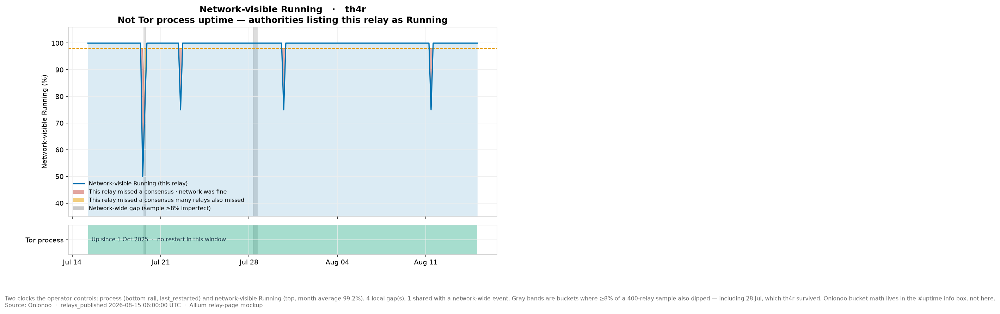

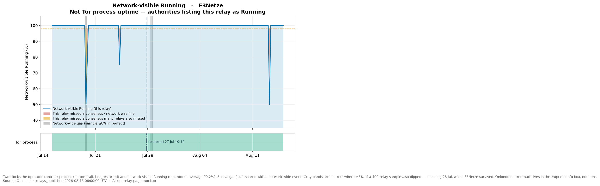

#### Onionoo bucket logic lives on the page

The 4 / 12 / 48 / 240 hourly-consensus packing is not common knowledge.
Do not leave it only in this doc. Put it on `#uptime` in the same
left-border info box used under the flags table ("Bandwidth Values
Explained"), plus short `title=` tooltips on the period pills and on
Overall Uptime.

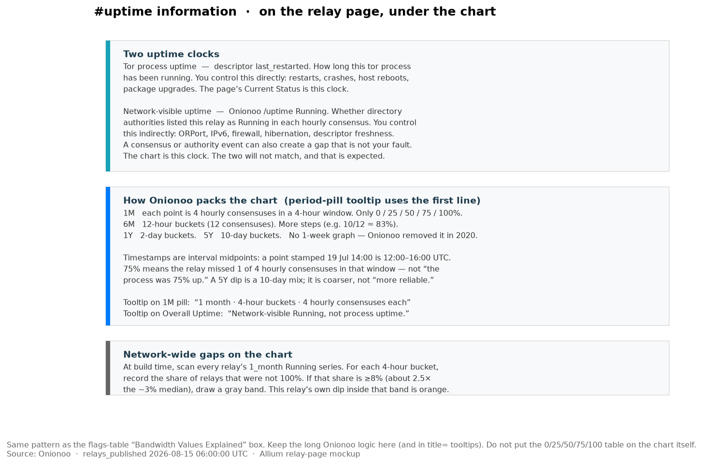

Pills stay short (`1M`). Tooltip: `1 month · 4-hour buckets · 4 hourly
consensuses each`. Overall Uptime tooltip: `Network-visible Running, not
process uptime.` The 0/25/50/75/100 table does not go on the chart.

#### Does `#uptime` match the chart?

The 1-month **average** matches. The gaps do not appear as numbers today.

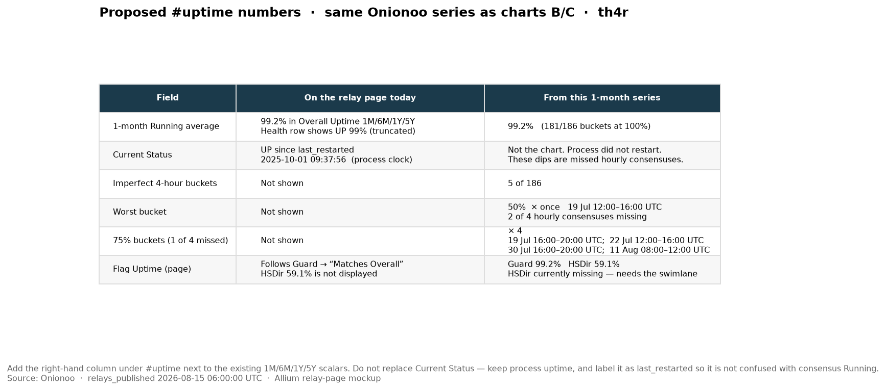

| Page field | th4r today | Same series as the chart |
|------------|------------|--------------------------|
| Overall Uptime 1M | **99.2%** | **99.2%** (181/186 buckets at 100%) |
| Health "UP N% (1M)" | **99%** (`\|int` truncates) | Should be 99.2% |
| Current Status | UP since 2025-10-01 | Process clock — not the chart |
| Imperfect buckets | not shown | **5 of 186** |
| Worst bucket | not shown | **50% × once**, 19 Jul 12:00–16:00 UTC (2 of 4 hours) |
| 75% buckets | not shown | **× 4** (19 Jul 16:00–20:00; 22 Jul 12:00–16:00; 30 Jul 16:00–20:00; 11 Aug 08:00–12:00) |
| Flag Uptime | "Matches Overall" (follows Guard) | Guard 99.2%; **HSDir 59.1% and currently missing** — hidden |

Add the right-hand column under `#uptime`. Keep Current Status; name it
as last_restarted. Stop truncating the health-row 1M percentage.

#### How long below 95% until a named flag is lost?

**There is no such duration.** The 95% line in the first B mockup was a
visual heuristic, not a dir-spec rule. Authorities do not read this
chart.

| Flag | Actual rule | Time to lose |
|------|-------------|--------------|
| Running | Authority could not connect in the last ~45 minutes | One missed hourly consensus. Shows as a 75% (3/4) bucket. |
| Guard | WFU ≥ **98%** (weighted; recent downtime counts more), plus Stable, TK ≥ 8 days, Fast, ≥2 MB/s | No fixed hours. A *recent* dip can drop WFU below 98% even when the monthly average is 99.2%. |
| HSDir | Same 98% WFU, plus Stable, TK ≥ 25 h (moria1 ~10 days) | Same. th4r's HSDir was present only 59.1% of this month. |
| Stable | Uptime or weighted MTBF ≥ network median (authority-specific, typically weeks) | One consensus-visible outage can reset MTBF. Not "% of the month." |

B now uses the real **98%** WFU floor and says on the chart that it is
not a countdown.

#### A — Annotated line

Dropped as a default. Labels do not scale, and they hid the 99.2% /
worst-bucket / once facts in a caption.

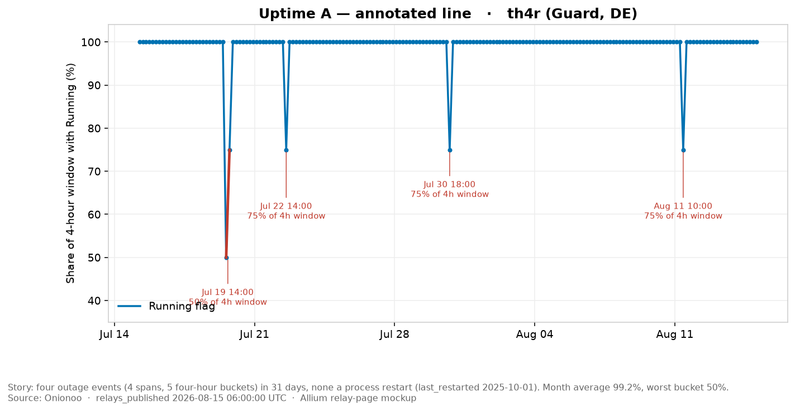

#### B — Area + 98% WFU floor (recommended history chart)

Month-average line at 99.2% (the `#uptime` number). 98% dashed line
labeled as the Guard / HSDir WFU floor, not a timer. Worst bucket
annotated on the plot: 50% once, 19 Jul 12:00–16:00 UTC. Flag rules and
the `#uptime` numbers sit under the axes.

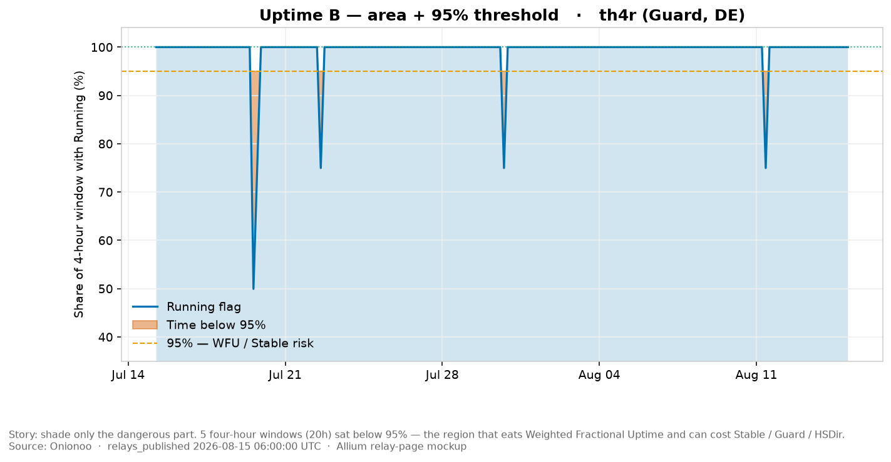

#### C — Time-of-day heatmap (1-month diagnostic, not a toggle of B)

Discrete 0/4 … 4/4 color scale — the only values Onionoo can emit at
this resolution. Newest day on top. A nightly cron lights up one column.
th4r's five dips sit at 08–12 / 12–16 / 16–20 UTC, not 04:00.

C is **only meaningful for `1_month`**. 6-month buckets are 12 hours;
1-year buckets are 2 days; 5-year buckets are 10 days. Do not toggle
B↔C. Give B a period control for every graph Onionoo actually published
(1M / 6M / 1Y / 5Y). Keep C as a second view of the 1-month series when
we want "is this a cron?"

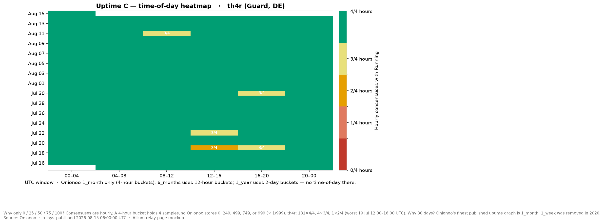

**Recommendation:** ship **B** as the `#uptime` history chart, with the
two-clock rail, shared-vs-local gap colors, and the `#uptime` info box
above. Add the numbers table next to the existing scalars. Add **C**
under B as a 1-month-only diagnostic, not a replacement toggle. Drop A.
Period display is a separate choice — see below.

#### How the four periods sit on the page

Onionoo publishes up to four `uptime` graphs. It **omits** a graph
until the relay has been around long enough — it does not send an empty
array. Live snapshot:

| Relay | First seen | 1M | 6M | 1Y | 5Y |
|-------|------------|----|----|----|----|
| PirateyMatey | 2026-08-12 (3 days) | 16 pts | — | — | — |
| th4r | 2025-10-01 (10 months) | 186 | 362 | 159 (from first seen, not 365d) | — |
| F3Netze | 2020-01-29 (6 years) | 186 | 362 | 183 | 183 |

`#uptime` already prints 1M/6M/1Y/5Y **scalars**. Allium turns a missing
or short series into `0.0` when `count < 30`. A chart must not do that.
If Onionoo omitted `5_years`, omit the period. Do not draw a 0% five-year
line.

F3Netze is why all four matter: **1M is 99.2%** (looks fine). **5Y is
89%** with real zeros. A 1-month-only chart would hide the long outages.

The site is static. A period switch cannot fetch. Whatever we ship is
N inline SVGs (one per published graph) plus CSS. No Chart.js, no query
string, no four HTML files per relay.

Three layouts:

**Pills (one visible).** CSS radio / `:checked` tabs. Default **1M**.
Only render pills Onionoo published. Label the bucket size on the chart
so a 10-day 5Y dip is not read as “smoother because more reliable.”
th4r has no 5Y pill. PirateyMatey has only 1M.

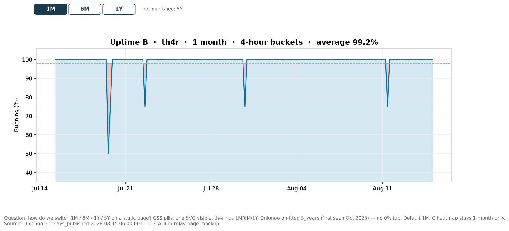

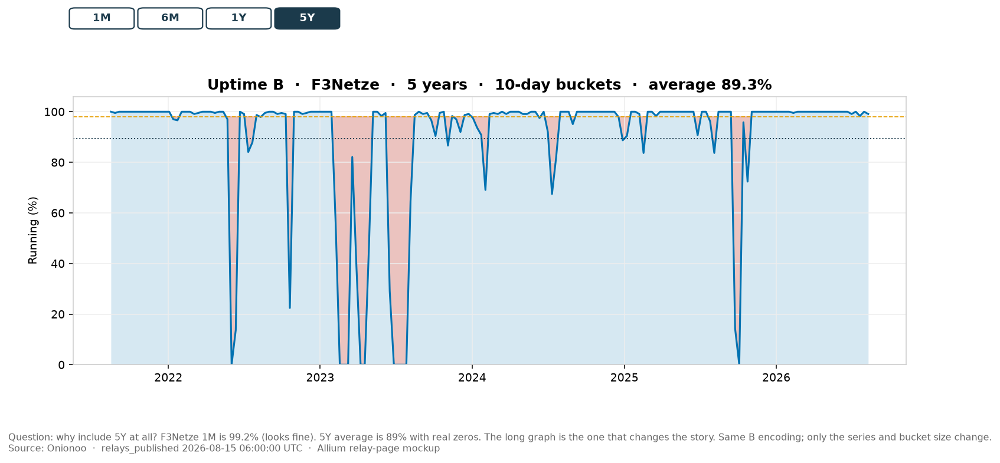

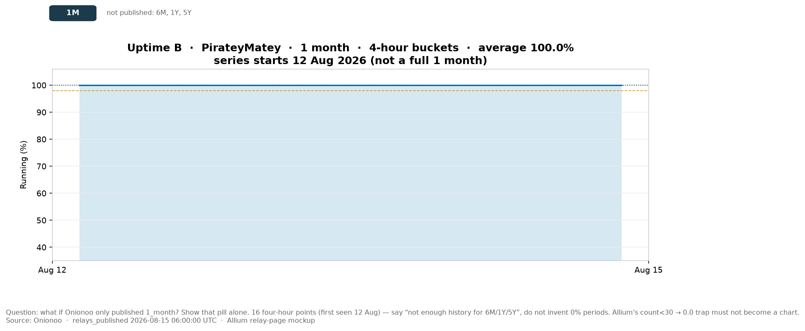

**Small multiples (all visible).** 2×2, shared y-axis 0–100. Empty cell
= not published. No click. Tall. Best when you want 1M and 5Y in the
same glance (F3Netze).

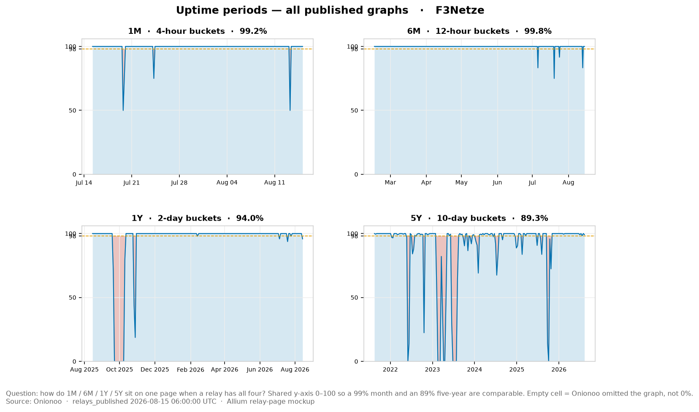

**1M hero + sparkline strip.** 1M stays large (finest buckets, matches
the health-row number). 6M / 1Y / 5Y are context underneath. Omit a
spark if the graph is missing. No click, less height than 2×2.

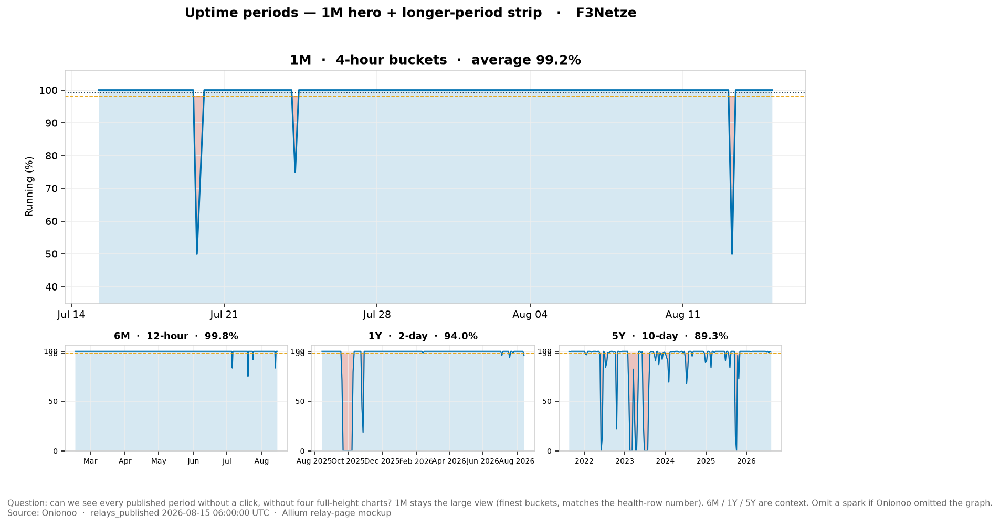

**Lean:** pills, default 1M, omit unpublished. Hero+sparks if we want
every period visible without a click. Do not stack four full B charts.
Do not run C on 6M/1Y/5Y. If a 1Y series starts at `first_seen` (th4r:
316 days), say so — it is not a full year.

---

### R2. Bandwidth (read / write)

Same data: F3Netze `read_history.1_month` / `write_history.1_month` (daily
buckets), plus **jeangrae** (`02B1…B108CF`) as a 1aeo.com Guard (effective
family 241, not overloaded). Red is reserved for problems (current overload
**title cue**; write/read **investigate** <0.80 or >1.50). 1.20 is amber
uncommon, not red. Write is purple, read is blue, advertised is orange dashed.

The throughput legend sits **above the axes**, never on the series or the
advertised line. Chart title on the page is `Throughput · last 30 days`
(the `#bandwidth` heading already says Bandwidth Metrics).

#### Overload is a now-indicator, not a time series

Onionoo has **no overload history graph** on any endpoint. `/uptime` and
`/bandwidth` publish `1_month` / `6_months` / `1_year` / `5_years`
arrays. Overload is three **point** fields:

| Field | Endpoint | What it is |
|-------|----------|------------|
| `overload_general_timestamp` | `/details` | Last time any general metric (OOM, onionskins, TCP ports) was detected. Milliseconds. |
| `overload_ratelimits` | `/bandwidth` | Snapshot: `timestamp`, rate/burst, read/write counts |
| `overload_fd_exhausted` | `/bandwidth` | Snapshot: `timestamp` |

There is no `overload_history.1_month`. The 72-hour window Allium already
uses (`OVERLOAD_THRESHOLD_HOURS` in `stability_utils.py`) is **inferred**
from proposal 328 — the flag stays 72h after the last report — not a
start/stop Onionoo recorded.

Overload is **not a consensus flag**. Consensus files have Running /
Guard / Stable / … — that history is already in Onionoo `/uptime`.
Overload lives on the **server descriptor** (`overload-general`) and
extra-info (`overload-ratelimits`, `overload-fd-exhausted`). A real
incident history would mean ingesting CollecTor server-descriptors /
extra-info over months, not scraping consensuses. Allium already fetches
~18h of recent descriptors for family-cert analysis; that is not a
multi-month overload archive.

Until that exists: keep overload **off the x-axis**. If `relays_published`
is still inside last-report + 72h (or a rate-limit / FD field is set),
show a quiet current cue (`currently overloaded · last report …`) in the
chart title or as a diamond in the legend — not a red pill. If not, no
cue — `#uptime` already has the overload subsection. Restart stays a
point at `last_restarted`.

F3Netze at this snapshot: last report 13 Aug 05:00 UTC, published
15 Aug 06:00 UTC (49h old) → badge on. Flag would drop at 16 Aug 05:00.

#### A — Dual line + advertised + imbalance (recommended)

Y-axis starts at 0 so the advertised line is on the plot. Restart is a
navy dash-dot at `last_restarted` (a point). Overload is a title-line
cue, not a band on the time axis and not a floating red badge. The
legend is above the plot so it cannot cover write, read, or advertised.

The bottom strip is write/read. The green band is a **fixed expected
range, not a live percentile**. A network DoS that hits every exit
would move p10–p90 and hide the event. Keep the expected range frozen;
add live aggregates as lines on top of it.

| Layer | What | Why |
|-------|------|-----|
| Typical 0.90–1.15 | Frozen typicality band. Full-network census: 1M p10–p90 is 0.965–1.130. **1.20 is uncommon, not investigate** (6.3% of 1M, mostly Guards). | Where healthy relays live |
| Uncommon 0.80–0.90 / 1.15–1.50 | Amber. Check the role overlay — a Guard at 1.20 is normal-for-Guards; an Exit at 1.20 is not. | Shoulder. Do not paint it red |
| Investigate <0.80 or >1.50 | Frozen rare-event line. 2.2% of 1M. Dirauths and genuinely lopsided relays. | The actual “look at this” alarm |
| This relay | Navy line | The thing the operator is debugging |
| Role peers | Dashed. Median write/read of the same flag set (Exit+Guard for F3Netze) | Did the whole role move? |
| This operator | Dotted. Median of the AROI / contact / effective-family group (F3: 24 relays). Omit if the group is 1. Use **median**, not mean — F3's mean is 1.17 because 4 of 24 members sit at 1.5–2.2 | Is this relay the odd one in the family? |

How to read the strip:

- Line stays green (0.90–1.15) → typical. Done.
- Line in amber (1.15–1.50 or 0.80–0.90), role overlay still near 1.0 → uncommon for this role; worth a glance, not a fire drill. 1.20 lives here.
- Line in amber, role overlay moved too → role-wide / network. The frozen typical band is what tells you the role moved.
- Line in red (<0.80 or >1.50) → rare. Investigate (or it is a directory authority).
- Family leaves, role stays → operator / AS / upstream.

Do not replace the green band with "this week's p25–p75." That is the
overlay's job.

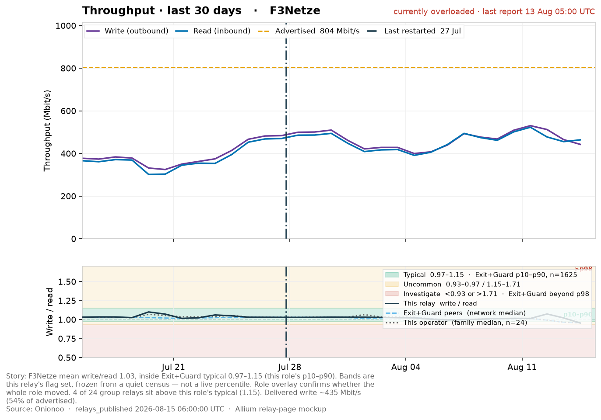

#### B — Overlapping area (same extras)

Same advertised line, restart marker, title-line overload cue, and
imbalance strip. Area fill instead of two lines. Keep as an alternate
encoding; A is the default.

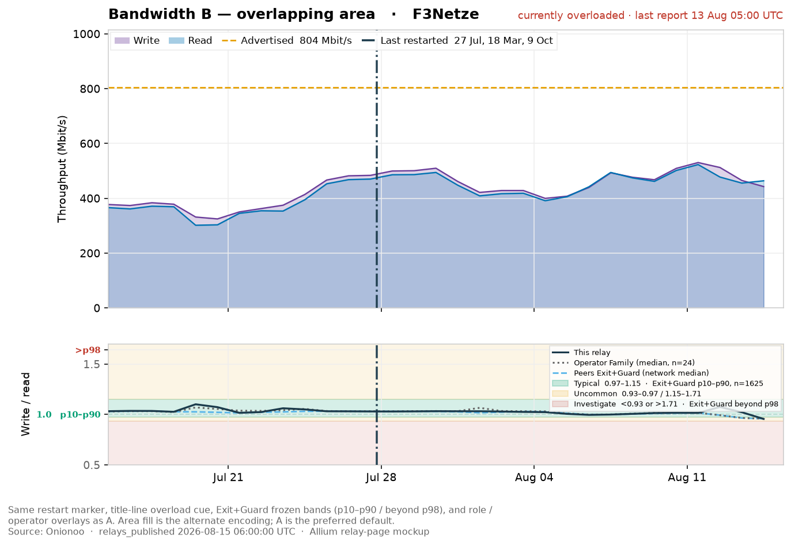

#### C — Daily bars vs advertised

Same restart marker and title-line overload cue. Useful if we ever want
day-by-day bars; not the default.

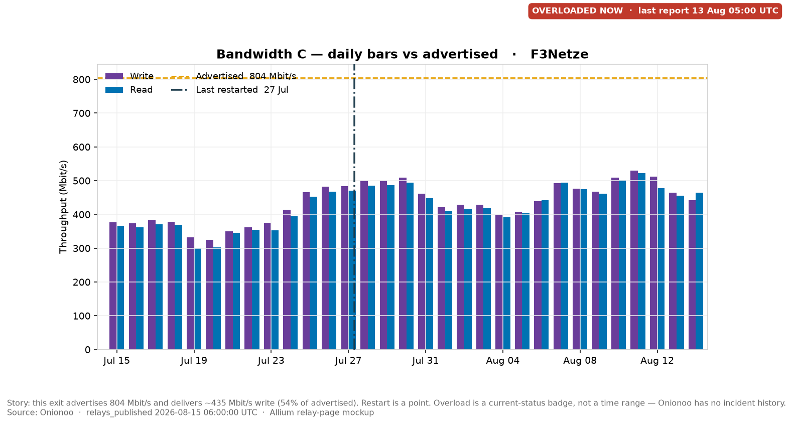

**Recommendation:** ship **A**. Daily Onionoo buckets hide intra-day
spikes; a persistent 5× split still leaves the green band.

Empty state: a two-day relay such as PirateyMatey (CW 1) should say
"not enough history" rather than draw two dots.

#### Where R2 sits on `#bandwidth` — three placements

The live section is already: heading → Capacity / Measurement two-column
→ Network Participation → (later) Bandwidth Values Explained. Three
ways to add the chart. Page mockups use Allium chrome (nav, health
grid, dimmed `#flags` / `#uptime`).

| Option | Placement | Overload cue | Example relay |
|--------|-----------|--------------|---------------|
| 1 Hero | First thing under **Bandwidth Metrics** | Rust status next to the `h4` | F3Netze (overloaded) |
| 2 After scalars | After Capacity / Measurement, before Network Participation | Title-right `currently overloaded · last report …` | **jeangrae** (1aeo, not overloaded) |
| 3 History subsection | After Network Participation, before Values Explained | Diamond in the legend | F3Netze |

Page mockups (open the HTML):

- [Option 1 — hero, F3Netze](mockups/relay_page_bw_opt1_hero_f3.html)
- [Option 2 — after scalars, jeangrae / 1aeo](mockups/relay_page_bw_opt2_after_metrics_jeangrae.html)
- [Option 3 — history subsection, F3Netze](mockups/relay_page_bw_opt3_history_f3.html)

Standalone charts used in those pages:


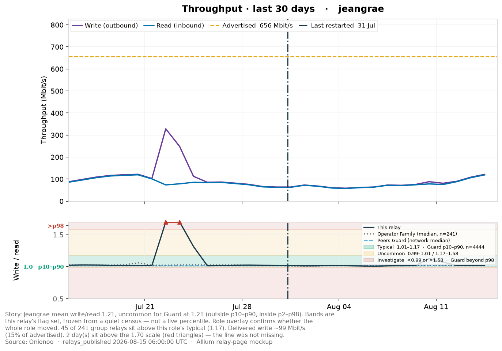

**Lean:** option 2. Health-grid `#bandwidth` already jumps to the
scalars operators scan today. The chart is the history those numbers
collapse. Option 1 makes the jump land on ink. Option 3 is the safest
progressive-enhancement add-on (a new `h5`, tables untouched) but the
chart is furthest from the heading.

Chart title on the page is `Throughput · last 30 days`, not
“Bandwidth A — dual line…”. Nickname stays in the page `h1`. Overload
details stay in `#uptime` `#overload`; the chart only repeats *that it
is on*.

---

### R3. Flag flapping — encodings vs questions

Onionoo `/uptime` already has per-flag histories: `flags.Running`,
`flags.Guard`, `flags.Stable`, `flags.HSDir`, `flags.Exit`, `flags.Fast`.
Allium averages them into "Flag Uptime 1M/6M/1Y/5Y". That is why th4r
can look like "99% uptime" while HSDir is gone.

The `#flags` eligibility table already answers the snapshot: *do I meet
WFU / time-known / Fast / Stable right now?* A chart should not redo
that. The time-series only earns its place if it answers a **when /
how often / what triggered it** question.

th4r's month is a handful of events, not a continuous quantity:

- 4 Running gaps (one or two 4-hour buckets each)
- 3 multi-day HSDir losses, each starting at a Running gap
- 1 flapping stretch (24–26 Jul) after a weak recovery
- Guard / Stable / Fast / V2Dir are **identical** to Running
- No process restart (`last_restarted` 2025-10-01)

A and B treat every flag as equally interesting and plot 186 buckets.
The cause (a 4-hour Running miss) is one pixel. That is why they feel
weak even when A is "better" than B.

#### A — Presence swimlane

**Question:** which flags were present, when?

One row per flag, 0–100% color. HSDir's long red stretches are visible.
The 4-hour Running gaps that cause them are hairline slivers, and three
of the four rows are copies of each other.

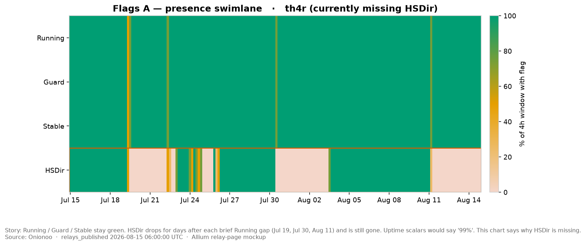

#### B — Overlay lines

**Question:** how did each flag's presence % move?

HSDir divergence is obvious. Running / Guard / Stable sit on top of
each other at 99% and hide the trigger gaps. Worse than A.

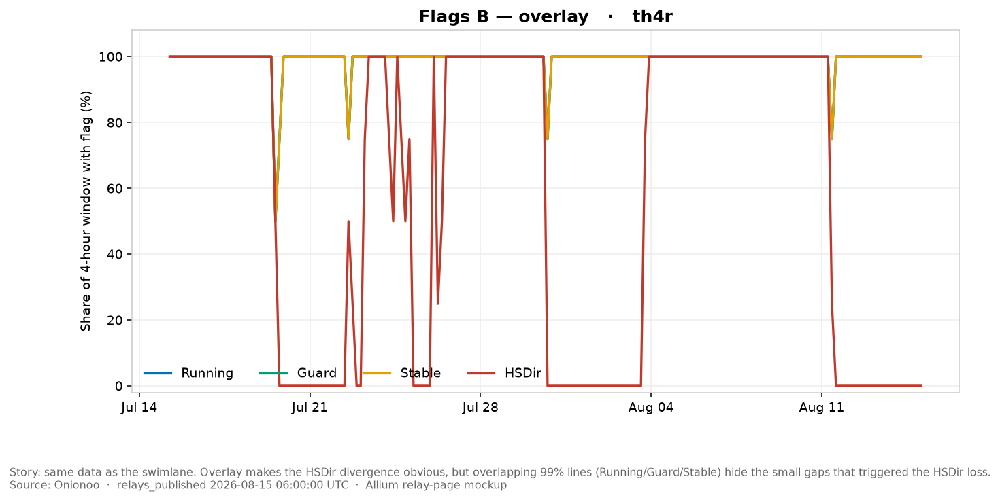

#### C — Cause → effect

**Question:** did a brief Running gap cost me a role flag, and for how
long?

Plot only the flag that moved (HSDir). Mark Running gaps as triangles.
Each red band is a loss; the label is the duration. Flags that tracked
Running become a one-line "held all month" note, not extra rows.

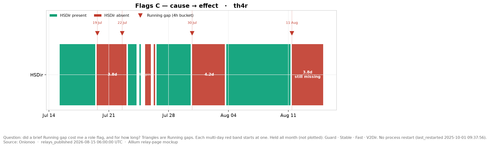

#### D — Loss episodes

**Question:** how many times did I lose HSDir this month, and how long
each time?

One row per episode, newest at the top. You can count the losses.
Dotted lines are the Running gaps. The orange row is the weak recovery
(not a fourth independent outage).

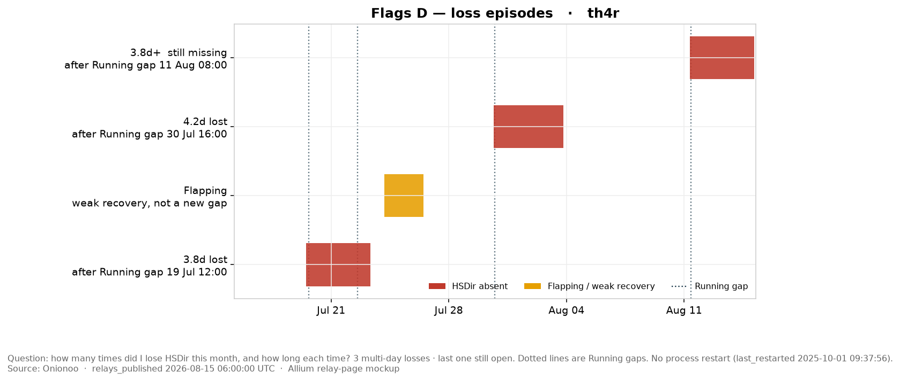

#### E — Only flags that moved

**Question:** which of my flags actually moved, and did they move
together?

A swimlane with the boring rows removed. Running gaps are widened so a
4-hour miss is visible. Two rows: Running vs HSDir. They do not move
together — that is the story.

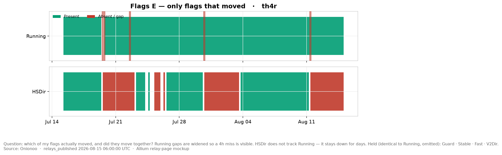

#### F — Status + month story

**Question:** do I have the flag right now, and what is the last-month
story in one glance?

A headline ("HSDir is missing since …") plus the counts, the trigger,
and a small presence strip. Closest to how an operator reads the page:
the table above says whether the snapshot passes; this says since when
and how often. Not a countdown — WFU ≥ 98% weights recent downtime.

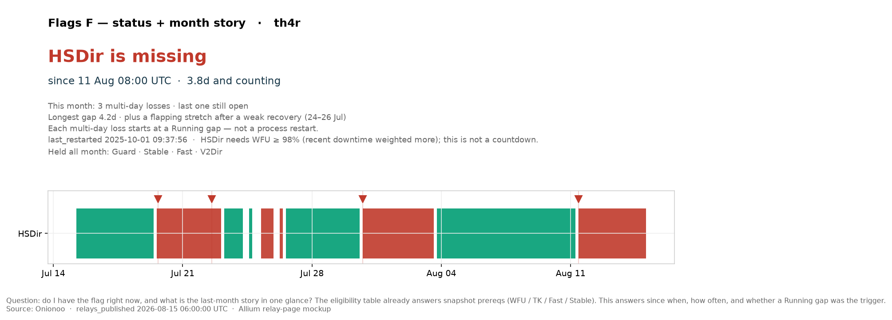

**Empty state:** if no role flag diverged from Running, skip the chart
and say "No role-flag losses this month." Do not draw four green rows.

**Recommendation:** unset. A is better than B but not the thing to
ship. C / D / E / F are the real choices — they each answer one
question instead of plotting every flag equally.

---

## Other relay-page charts — yes, later, or never

| Idea | Verdict | Why |
|------|---------|-----|
| Flag flapping | **Yes — R3** | Onionoo already has it; scalars hide it |
| Overload / restart markers | **Restart on R1/R2; overload is a title / legend cue** | Onionoo has no overload history; do not invent a 72h range on the x-axis |
| Advertised vs delivered | **Yes — line on R2** | Same bandwidth series |
| This relay vs network CW/BW | Later, one percentile | Full scatter is a network-health chart |
| Guard eligibility histogram | No | Table already answers "why no Guard" |
| Consensus-weight over time | Not from Onionoo | Needs CollecTor / ClickHouse |
| Observed-bandwidth over time | Not from Onionoo | `/bandwidth` is traffic, not `observed_bandwidth` |
| IPv6 reachability over time | Not from Onionoo | Snapshot diagnostic only |
| Per-authority vote history | Later | CollecTor votes; current table is enough |
| Family / version / ORPort | No chart | Already diagnostics in `#status` |

Do not restart to clear overload (list advice). Restart is a point so
the operator can see whether a gap and `last_restarted` are the same
event. Overload is a current title / legend cue, not a range: Onionoo
does not give incident start/stop, and consensus files do not carry
overload. th4r's gaps are **not** restarts.

---

## Where they sit on the existing page

```
#status          health grid          — no new chart
#connectivity    addresses / IPv6     — no new chart
#flags           eligibility table    — then R3 (encoding unset; C–F)
#bandwidth       capacity + bwauths   — then R2 A (option 2; hero / history-h5 are the alts)
#uptime          1M/6M/1Y/5Y scalars + gap counts
                 info box: two clocks + Onionoo bucket table + pill tooltips
                 then R1 B (network-visible Running + process rail + shared gaps)
                 period pills 1M/6M/1Y/5Y (omit unpublished; default 1M)
                 1-month time-of-day heatmap C     — under B, not a toggle
                 overload subsection               — title/legend cue on R2; details here
```

Progressive enhancement: the tables stay if the SVG is missing. B gets a
period control (1M / 6M / 1Y / 5Y; omit unpublished). C stays 1-month-only.

---

## Implementation notes (after encoding pick)

1. Keep every Onionoo-published uptime graph (`1_month` / `6_months` /
   `1_year` / `5_years`) as `values` + `first` + `interval` + `factor`
   on the relay. Same for per-flag uptime and read/write if those
   periods exist. Do not invent a series when Onionoo omitted the key.
   Do not treat Allium's `count < 30 → 0.0` scalar as a chartable 0%.
2. Render **build-time SVG** in the Jinja templates. One static Chart.js
   on 11k pages is the wrong default for a static site.
3. Color: red only for problems this relay owns (local Running gap,
   current overload title/legend cue, write/read **investigate** <0.80
   or >1.50, missing flags). 1.20 is amber uncommon, not red.
   Shared/network gaps are orange + gray, not red. Write is purple, read
   is blue, advertised is orange, last-restarted is navy. Typical
   0.90–1.15 and investigate <0.80 / >1.50 are frozen constants, not
   live percentiles. Restart is an `axvline` at `last_restarted`.
   Overload is **not** on the time axis: if `current_overload_status`
   (from `evaluate_overload`) says the relay is currently overloaded,
   put a quiet cue in the title or legend; otherwise omit it. Do not
   infer a 72h `axvspan`. History would need CollecTor
   server-descriptors / extra-info, not consensus files. The throughput
   legend is above the axes so it never covers data.
4. At build time, from every relay's `uptime.1_month`, compute the
   imperfect-Running share per 4-hour bucket. Median is ~3%. Mark
   buckets ≥8% as network-wide gaps and reuse that series on every
   relay chart. Same idea for 6M/1Y/5Y if we show those periods.
5. `#uptime` info box (two clocks + Onionoo bucket table) plus `title=`
   tooltips on the period pills and Overall Uptime. Do not put the
   0/25/50/75/100 table on the SVG. At build time, keep per-relay
   `1_month` write/read arrays and compute daily median write/read for
   each flag-set and each AROI/contact group. Overlay those on the
   imbalance strip. Omit the operator line when the group has one relay.
6. Generate `www_baseline` / `www_after` and run `compare_outputs.py`
   before merging — every relay HTML page will change.

---

## How to regenerate

```bash
python3 docs/features/planned/charts/generate_relay_page_chart_variations.py
python3 docs/features/planned/charts/analyze_write_read_ratios.py \
  --details /tmp/onionoo/details_flags.json
```

Chart mockups need the Onionoo snapshots already used by
[`generate_onionoo_chart_mockups.py`](generate_onionoo_chart_mockups.py)
(`/tmp/onionoo/details.json`, `uptime_examples.json`,
`bandwidth_examples.json`). The write/read band survey needs a full
`/bandwidth` dump — see [`write-read-band.md`](write-read-band.md).
