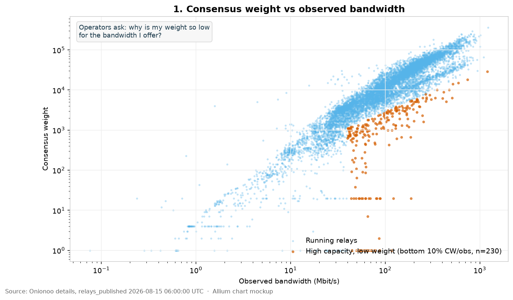
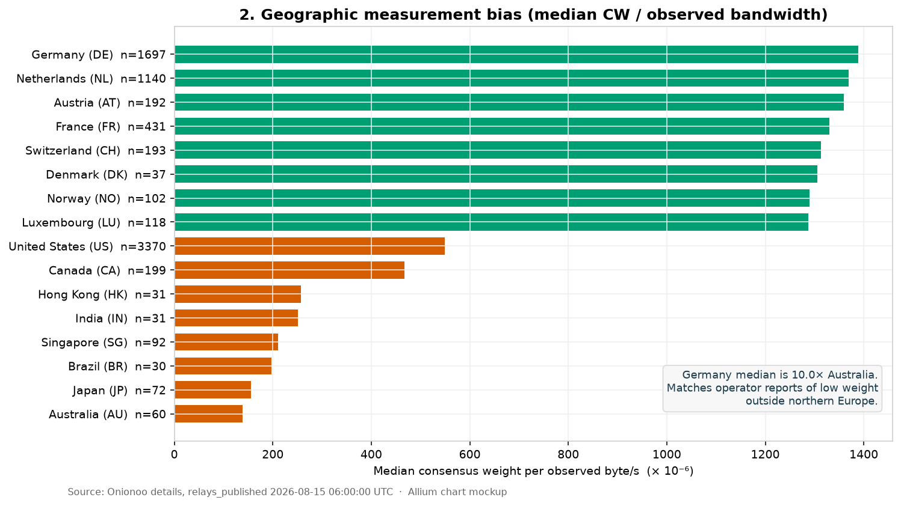
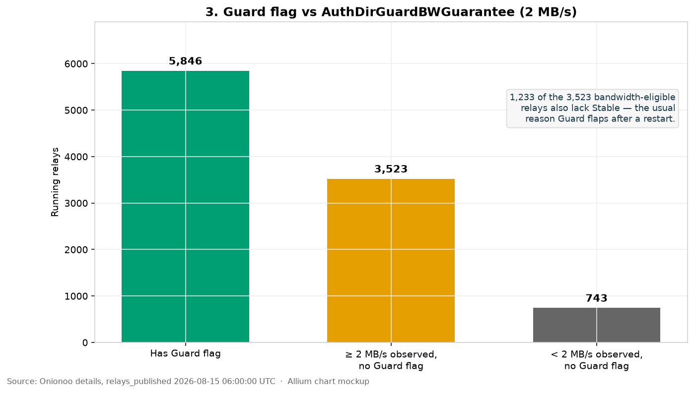
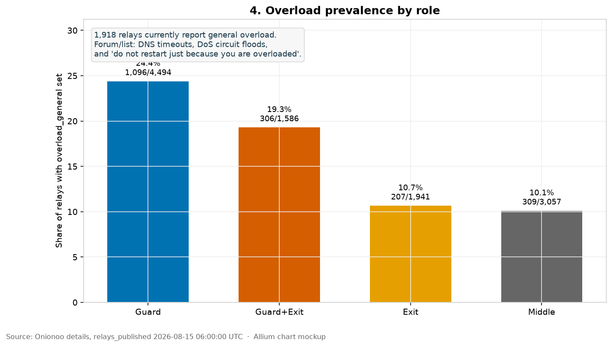
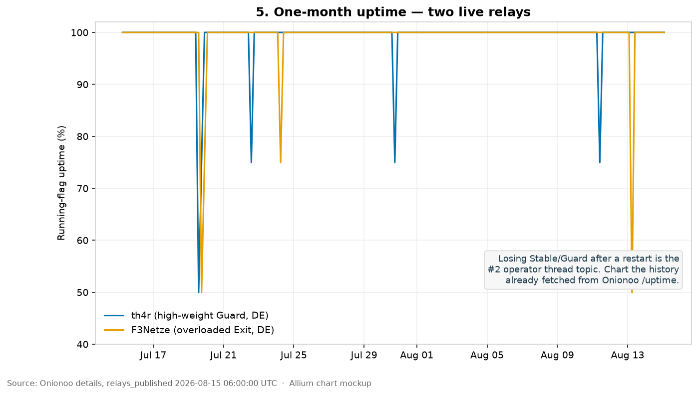
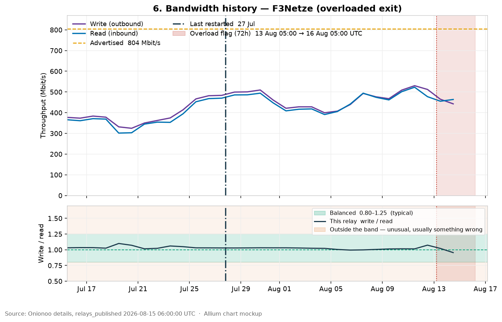
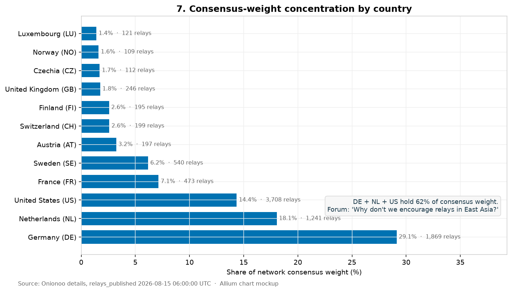
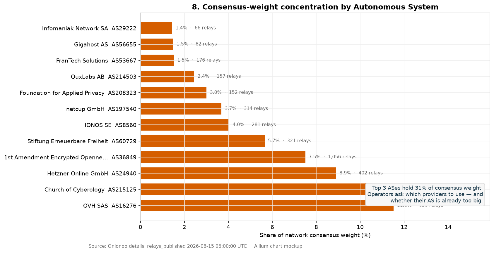
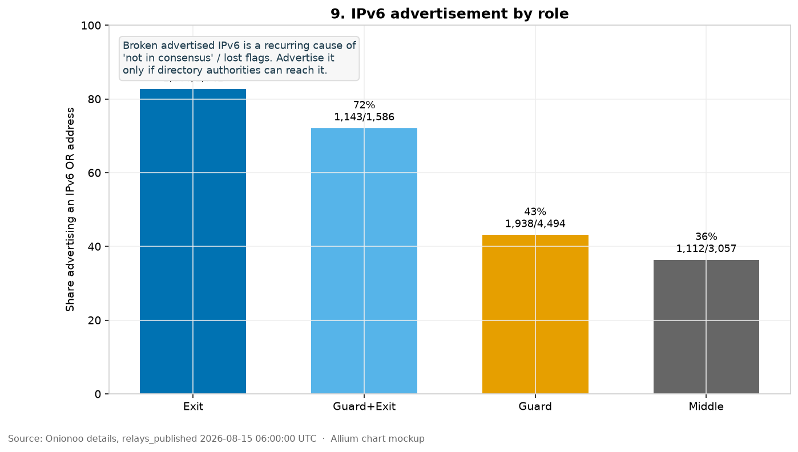
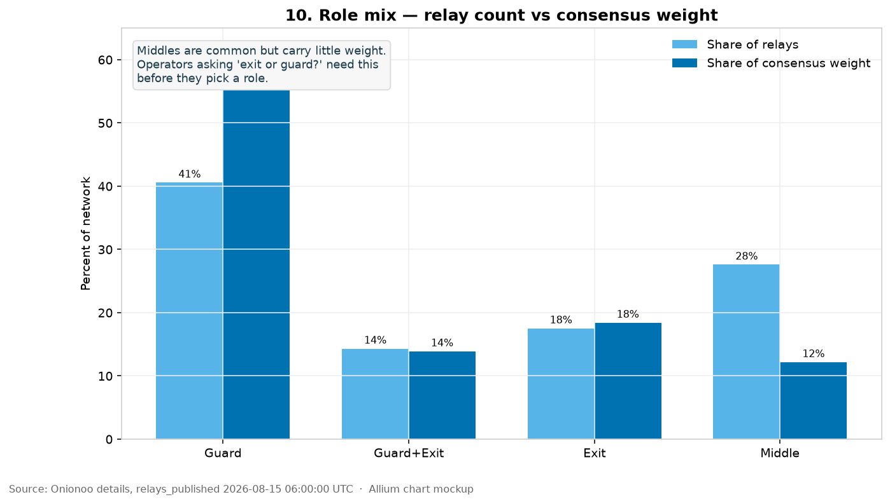

# Top 10 Operator Charts

**Audience**: Contributors
**Scope**: Which charts to add first, why operators need them, and what live Onionoo shows today
**Status**: Proposal with mockups from Onionoo `relays_published` 2026-08-15 06:00 UTC (11,078 relays)

Allium already fetches Onionoo `/details`, `/uptime`, and `/bandwidth` and collapses them to scalars. These ten charts use that same data. No new API and no database.

Mockups: [`mockups/`](mockups/). Regenerator: [`generate_onionoo_chart_mockups.py`](generate_onionoo_chart_mockups.py).

Relay-page encodings (three variations each of charts 5 and 6, plus flag
flapping): [`relay-page-charts.md`](relay-page-charts.md).

---

## What operators actually ask

### tor-relays@ and the operator forum

Recurring threads (2024–2026), plus the Allium mailing-list notes in `relay-page-layout-consolidated.md` and `operator_comparison_metrics_proposal_top10.md`:

| Rank | Operator question | Typical thread |
|------|-------------------|----------------|
| 1 | Why is my consensus weight so low for the bandwidth I offer? | Weight stuck at 1–200; EU vs US authority votes; "unbalanced incoming traffic and drop of consensus weight" |
| 2 | Why did I lose Guard / Stable / HSDir? | Guard flaps after restart; missing Stable; WFU / Time Known |
| 3 | Is my advertised IPv6 taking me out of consensus? | Exit "offline" until IPv6 disabled; no Happy Eyeballs fallback |
| 4 | Am I overloaded — and should I restart? | DNS timeouts; DoS circuit floods; "do not restart daily" |
| 5 | Why is metrics bandwidth far below my VPS / rate cap? | 1 Gbps VPS showing a few MiB/s observed |
| 6 | Where should I put the next relay? | "Why don't we encourage relays in East Asia?"; Good/Bad ISPs |
| 7 | Is my provider already too concentrated? | Hosting-provider threads; AS centralization |
| 8 | Exit or guard? One instance or many? | "1 Gbit/s Tor relay" vs multiple instances |
| 9 | How long until a change shows up? | Raised `RelayBandwidthRate`; new relay ramp |
| 10 | Is my family / version / reachability wrong? | Happy Family keys; recommended version; ORPort not reachable |

Recent list traffic (Jul–Aug 2026) adds DoS circuit floods on guards, traffic spikes that crash relays and drop flags, and a PQC/OpenSSL upgrade push. Those are #4, #2, and version hygiene — not a new chart family.

### What Allium already logs

`relay_diagnostics.py` encodes the same list as 16 consensus issues + 6 overload issues:

- Not in consensus; IPv4 / IPv6 reachability
- Guard: Fast, Stable, 2 MB/s, WFU, Time Known
- Stable / HSDir eligibility
- High consensus-weight deviation across authorities; low bwauth measurements
- StaleDesc, BadExit, MiddleOnly
- Version not recommended
- General overload, rate-limit hits, FD exhaustion

The intelligence engine already flags underutilized relays (high bandwidth, low weight). None of this is drawn.

---

## The ten charts

Implement 1–6 on relay and contact pages first. 7–10 belong on network-health / country / AS pages.

### 1. Consensus weight vs observed bandwidth

**Issue:** #1 operator complaint.
**Page:** Network health + contact (operator's relays highlighted).
**Data:** `/details` `consensus_weight`, `observed_bandwidth`.

Live snapshot: 230 running relays sit in the bottom 10% of CW/observed while offering ≥5 MB/s. That is the "I have capacity and almost no weight" cluster.



### 2. Geographic measurement bias

**Issue:** Low weight outside northern Europe. Roger on-list: two-hop sbws overestimates relays near other fast relays.
**Page:** Country pages + network health.
**Data:** Median `consensus_weight / observed_bandwidth` for countries with ≥30 running relays.

Live snapshot: Germany median is 10× Australia. US (3,708 relays) is well below DE/NL/AT/FR. This is the chart that tells an Australian operator their low weight is systemic, not a broken `torrc`.



### 3. Guard flag vs 2 MB/s guarantee

**Issue:** "I have Fast, HSDir, Running, Stable, V2Dir, Valid — why no Guard?"
**Page:** Relay `#flags` + network health.
**Data:** `flags`, `observed_bandwidth` vs `AuthDirGuardBWGuarantee` (2 MB/s).

Live snapshot: 5,846 running Guards; 3,523 relays are ≥2 MB/s and still lack Guard; 1,233 of those also lack Stable. Bandwidth is rarely the only missing piece.



### 4. Overload by role

**Issue:** Overload, DNS timeouts, DoS. Advice on-list: do not restart just to clear overload (you lose Stable/Guard).
**Page:** Network health + relay `#uptime`.
**Data:** `overload_general_timestamp`.

Live snapshot: 1,918 relays report general overload. Guards are worst (24.4%, 1,096/4,494). Exits 10.7%. This is a current network condition, not a rare badge.



### 5. Uptime history (one month)

**Issue:** Lost Stable/Guard after a restart or crash.
**Page:** Relay `#uptime`, then contact (overlay the operator's relays).
**Data:** `/uptime` `uptime.1_month.values` (already fetched for `--apis all`).

Live example: `th4r` (high-weight Guard) and `F3Netze` (overloaded exit) — both mostly 100% Running, with short dips that are exactly what knocks WFU/Stable.



### 6. Bandwidth read/write history

**Issue:** Ramp time after raising rate; "5–10× more outgoing than incoming"; traffic spikes that crash the process.
**Page:** Relay `#bandwidth`.
**Data:** `/bandwidth` `read_history` / `write_history`.

Live example: `F3Netze` stays near 1:1 read/write around 300–530 Mbit/s. A 5–10× split is the anomaly. New relay `PirateyMatey` (NL, consensus weight 1, two days of history) is the "stuck at weight 1" case. Restart is a point at `last_restarted`; overload is the 72-hour flag window after the last Onionoo report, not a single marker.



### 7. Consensus-weight share by country

**Issue:** Where to add capacity; East Asia under-representation.
**Page:** `misc/countries.html`, network health.
**Data:** Sum of `consensus_weight` by `country`.

Live snapshot: DE 29.1%, NL 18.1%, US 14.4% — 62% in three countries. US has the most relays (3,708) but only third in weight (see chart 2).



### 8. Consensus-weight share by AS

**Issue:** Provider choice; "is my AS too big?"
**Page:** AS pages + network health.
**Data:** Sum of `consensus_weight` by `as`.

Live snapshot: OVH 11.5%, Church of Cyberology 11.0%, Hetzner 8.9% — top 3 ASes hold 31% of weight.



### 9. IPv6 advertisement by role

**Issue:** Advertising unreachable IPv6 removes the relay from consensus. Tor does not fall back to IPv4 on that attempt.
**Page:** Relay `#connectivity` + network health.
**Data:** IPv6 in `or_addresses`.

Live snapshot: Exit 83%, Guard+Exit 72%, Guard 43%, Middle 36%. High exit adoption is good only if those addresses stay reachable — Allium already has the IPv6-not-reachable diagnostic.



### 10. Role mix: count vs weight

**Issue:** Exit vs guard vs many instances on one CPU.
**Page:** Network health.
**Data:** Flags + `consensus_weight`.

Live snapshot: Guards are 41% of relays and 55% of weight. Middles are 28% of relays and 12% of weight. Exits match (~18% / 18%).



---

## What not to build first

- World heatmaps — RouteFluxMap already is the map. Link it; do not rebuild D3.
- AROI achievement wheels / radar charts — recognition, not troubleshooting.
- Per-authority vote charts — need CollecTor votes, not Onionoo. Keep as a later relay-page panel (issue #22).
- Bridge-only dashboards — separate track (`#50`); forum traffic is heavy on Snowflake/WebTunnel, which Allium does not ingest.

---

## Implementation order (page type by page type)

1. **Relay page** — encodings and placement are in
   [`relay-page-charts.md`](relay-page-charts.md). Uptime (chart 5),
   bandwidth (chart 6), and a new flag-flapping swimlane. Chart 1 (network
   scatter) and chart 3 (Guard histogram) do **not** go on every relay
   page; this page already has a CW percentile and an eligibility table.
2. **Network health:** charts 4, 7, 8, 9, 10 as CSS/SVG bars from existing
   `network_health` aggregates. Chart 1 scatter lives here.
3. **Country page:** chart 2 (this country vs DE/US/AU medians).
4. **Contact / AS pages:** overlay the operator's relays on the same
   encodings after the single-relay versions ship.

Keep each chart progressive: a table or number remains if JS is off.

---

## How to Verify

```bash
# Refresh Onionoo details (fields used by the mockups)
curl -sS --compressed -o /tmp/onionoo/details.json \
  'https://onionoo.torproject.org/details?type=relay&fields=nickname,fingerprint,flags,running,measured,observed_bandwidth,advertised_bandwidth,bandwidth_rate,consensus_weight,country,as,as_name,or_addresses,overload_general_timestamp,version,recommended_version'

# Example histories used in charts 5–6
curl -sS --compressed -o /tmp/onionoo/uptime_examples.json \
  'https://onionoo.torproject.org/uptime?lookup=27A06581F1CE22D1BA4D160F6E7C7AABAC176242,3C89C80E2699FB6358BBB64FDC9547AFCB5C03F7,DD32947397C5E6A5FC0D6A6BBE5CD008DEC1A60B'
curl -sS --compressed -o /tmp/onionoo/bandwidth_examples.json \
  'https://onionoo.torproject.org/bandwidth?lookup=27A06581F1CE22D1BA4D160F6E7C7AABAC176242,3C89C80E2699FB6358BBB64FDC9547AFCB5C03F7,DD32947397C5E6A5FC0D6A6BBE5CD008DEC1A60B'

python3 docs/features/planned/charts/generate_onionoo_chart_mockups.py
```

Numbers in this document must match a regenerate from the same `relays_published` timestamp. Live Onionoo will drift; the chart types should not.
