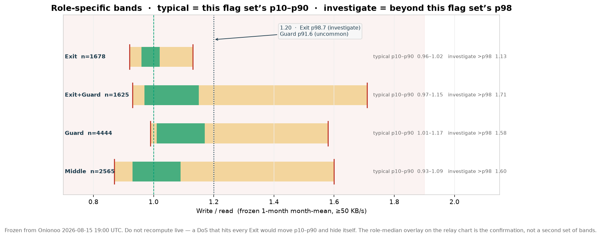
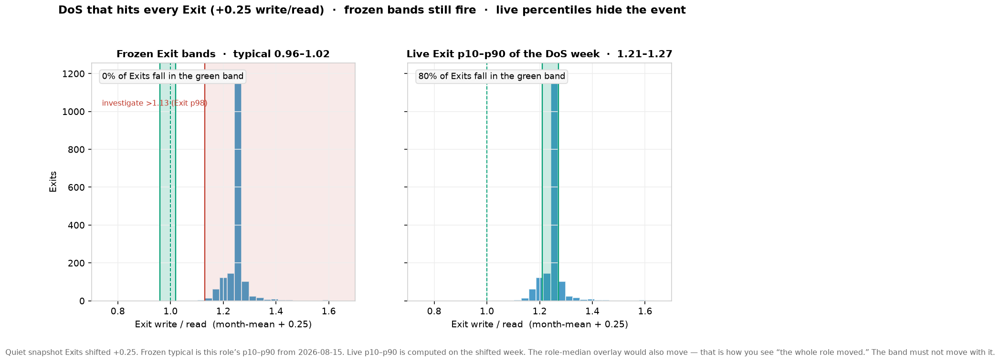
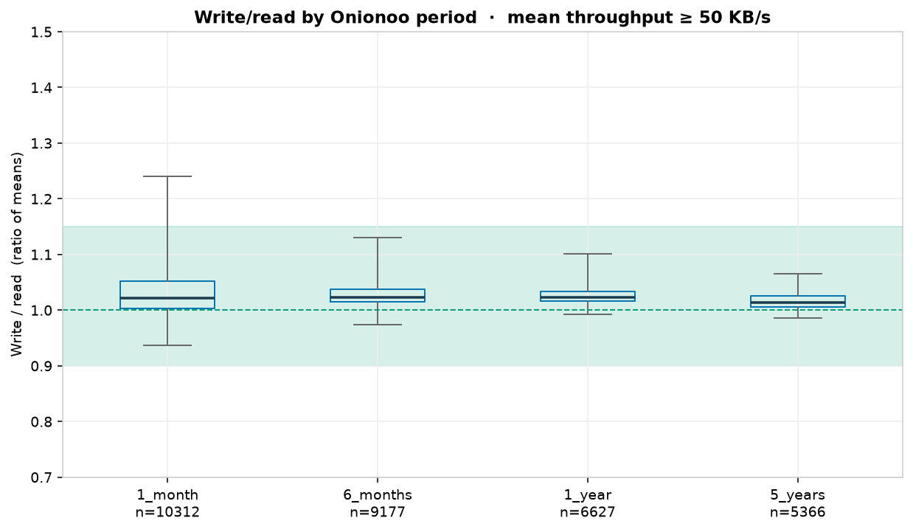
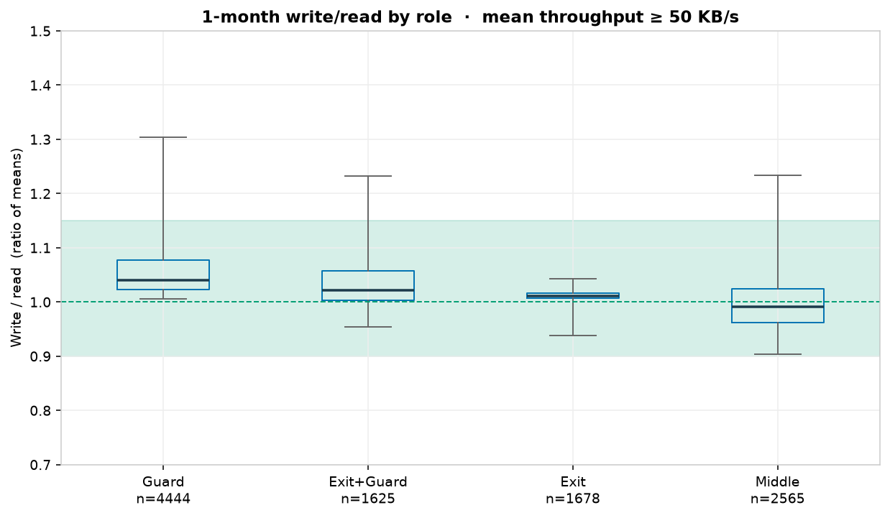
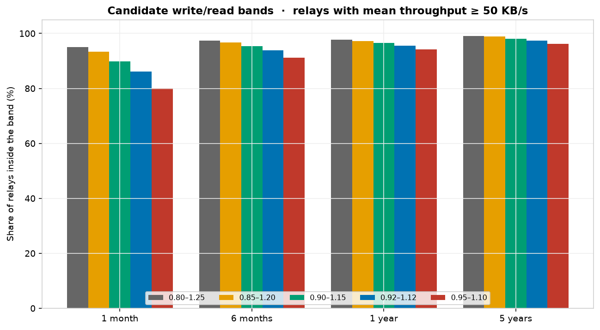
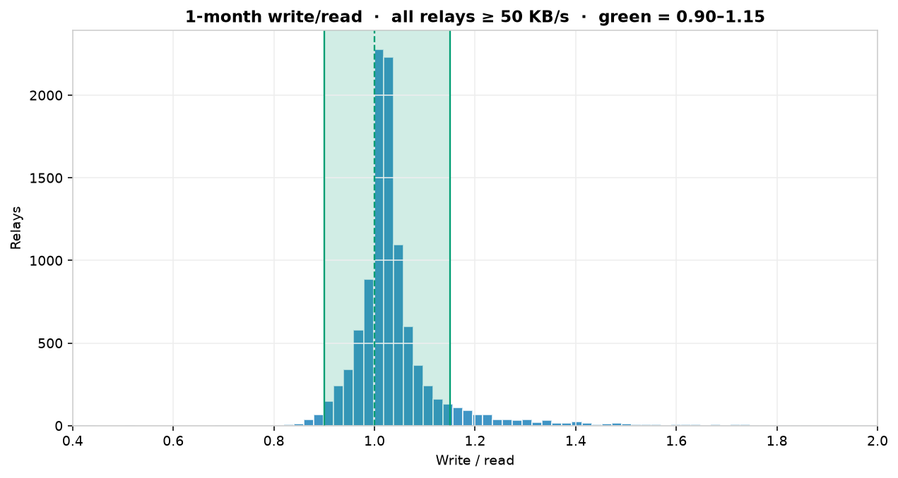
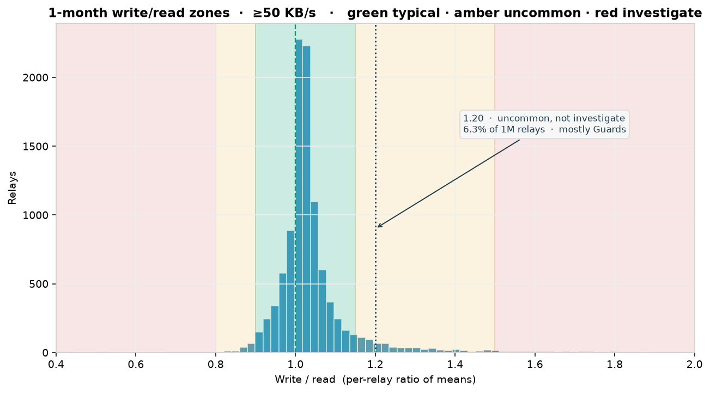

# Write / read expected band

**Audience**: Contributors
**Data**: Onionoo `/bandwidth` + `/details`, `relays_published` 2026-08-15 19:00 UTC
**Dump**: 11,306 bandwidth documents, 11,081 details
**Regenerator**: [`analyze_write_read_ratios.py`](analyze_write_read_ratios.py)
**Numbers**: [`data/write_read_ratio_survey.json`](data/write_read_ratio_survey.json)

## Recommendation

**Per-role frozen bands**, from this relay’s flag set (Exit / Guard /
Exit+Guard / Middle). Typical is this role’s **p10–p90**. Investigate
is outside this role’s **p2–p98** (the 2% tails — “beyond 98% of this
role”). Uncommon is the shoulder between those.

Constants: [`data/role_ratio_bands.json`](data/role_ratio_bands.json),
census `relays_published` 2026-08-15 19:00 UTC, ≥50 KB/s, 1-month
ratio of means.

| Role | n | Typical (p10–p90) | Investigate (beyond p98) | Where 1.20 sits |
|------|--:|-------------------|--------------------------|-----------------|
| Exit | 1,678 | 0.96–1.02 | <0.92 or >**1.13** | p98.7 → investigate |
| Exit+Guard | 1,625 | 0.97–1.15 | <0.93 or >1.71 | p93.6 → uncommon |
| Guard | 4,444 | 1.01–1.17 | <0.99 or >1.58 | p91.6 → uncommon |
| Middle | 2,565 | 0.93–1.09 | <0.87 or >1.60 | p94.3 → uncommon |

p98, not p99: an Exit at 1.20 is p98.7. p99 (1.26) would leave that
Exit amber. Guard p99 is 2.04 (dirauth territory) and would hide a
1.6 Guard. Label the bands with those percentiles so “suspicious”
means “rarer than 98% of this flag set,” not “off a global 0.90–1.15.”

The role-median overlay stays on the chart as confirmation. Do not
write “check role overlay” on the uncommon swatch — the line is
already there. If this relay and the overlay both leave the green
band, the role moved. If only this relay left, it is this relay.

**DoS:** freeze the bands. A live p10–p90 computed at build time from
this week’s Exits would walk with a network-wide Exit DoS and paint
the event green. The frozen Exit typical (0.96–1.02) still fires.
The overlay moving is how you *see* the DoS; the band moving is how
you *hide* it.





## How the survey was done

For each relay and each published period (`1_month`, `6_months`, `1_year`,
`5_years`), align `write_history` and `read_history` buckets and compute
`sum(write) / sum(read)`. That is the per-relay number. The chart strip
plots daily `write_i / read_i`; those are reported separately.

Tiny relays make noisy ratios (a 1 KB/s day can land at 0.1 or 40). The
primary cut is mean throughput `(write+read)/2 ≥ 50 KB/s` and at least
three aligned points. Sensitivity: dropping the cut to 0 or raising it to
500 KB/s barely moves p10–p90.

Onionoo graph coverage at this snapshot:

| Period | Relays with a write graph | ≥50 KB/s and ≥3 points |
|--------|---------------------------|-------------------------|
| 1 month | 10,818 | 10,312 |
| 6 months | 9,481 | 9,177 |
| 1 year | 6,885 | 6,627 |
| 5 years | 5,524 | 5,366 |

## Per-relay ratio of means  ·  ≥50 KB/s

| Period | n | p5 | p10 | p50 | p90 | p95 | in 0.90–1.15 |
|--------|--:|----:|-----:|-----:|-----:|-----:|-------------:|
| 1 month | 10,312 | 0.936 | 0.965 | 1.021 | 1.130 | 1.240 | 89.8% |
| 6 months | 9,177 | 0.974 | 0.991 | 1.023 | 1.074 | 1.131 | 95.4% |
| 1 year | 6,627 | 0.992 | 1.001 | 1.022 | 1.059 | 1.102 | 96.5% |
| 5 years | 5,366 | 0.985 | 0.996 | 1.014 | 1.044 | 1.066 | 98.0% |

Median is 1.01–1.02 on every period. Longer graphs are tighter because
they average more buckets. **1 month is the noisiest and the chart
default**, so the typical band has to fit 1M. 0.90–1.15 is 1M p10–p90
(0.965–1.130) with a little room. It is not the investigate line.



## 1-month by role  ·  ≥50 KB/s

| Role | n | p10 | p50 | p90 | p95 | in 0.90–1.15 |
|------|--:|-----:|-----:|-----:|-----:|-------------:|
| Guard | 4,444 | 1.014 | 1.040 | 1.174 | 1.304 | 87.8% |
| Exit+Guard | 1,625 | 0.967 | 1.021 | 1.147 | 1.236 | 90.0% |
| Exit | 1,678 | 0.962 | 1.011 | 1.021 | 1.042 | 97.4% |
| Middle | 2,565 | 0.925 | 0.991 | 1.093 | 1.234 | 88.3% |

Exits are almost 1:1. Guards sit a bit write-heavy (median 1.04, p90
1.17). That is a **role shape**, not a reason to widen the alarm. The
role-peer overlay is how the operator sees “the whole Guard set moved.”
A single Guard at 1.17 is uncommon vs bidirectional circuits, typical
vs other Guards. Amber + role overlay, not red.



## Daily points (what the strip actually plots)

Same ≥50 KB/s relays, every aligned bucket:

| Period | points | p10 | p50 | p90 | p95 | in 0.90–1.15 |
|--------|-------:|-----:|-----:|-----:|-----:|-------------:|
| 1 month | 298,350 | 0.958 | 1.016 | 1.075 | 1.242 | 90.5% |
| 6 months | 1,402,297 | 0.988 | 1.018 | 1.054 | 1.101 | 94.7% |
| 1 year | 1,100,636 | 0.995 | 1.017 | 1.055 | 1.100 | 95.1% |
| 5 years | 553,916 | 0.981 | 1.012 | 1.054 | 1.098 | 94.3% |

Most days sit even tighter than the per-relay means. The fat tail is the
same: p95 ≈ 1.24 on 1M. The band will not flicker on a normal day.

## Candidate bands

Share of ≥50 KB/s relays whose *month-mean* sits inside each candidate:

| Band | 1M | 6M | 1Y | 5Y | Verdict |
|------|---:|---:|---:|---:|---------|
| 0.80–1.25 | 95.0% | 97.7% | 98.3% | 99.2% | Too wide. Hides the 500 relays above 1.25 |
| 0.85–1.20 | 93.4% | 96.8% | 97.3% | 98.9% | Only +3.6 points vs 0.90–1.15 on 1M |
| **0.90–1.15** | **89.8%** | **95.4%** | **96.5%** | **98.0%** | **Typical layer. Not investigate.** |
| 0.92–1.12 | 86.1% | 93.3% | 95.3% | 97.3% | Clips Guard p90 (1.17) |
| 0.95–1.10 | 80.1% | 90.6% | 93.8% | 96.4% | Cries wolf on a normal 1M Guard |





## Who is outside typical, and who is actually rare

1,048 of 10,312 1M relays (10.2%) sit outside 0.90–1.15. That is the
**shoulder plus the tail**, not a 10% investigate list.

| 1M bucket | n | share | Mostly |
|-----------|--:|------:|--------|
| <0.80 investigate | 15 | 0.1% | Middles |
| 0.80–0.90 uncommon | 132 | 1.3% | Middles (103) |
| 0.90–1.15 typical | 9,264 | 89.8% | everyone |
| 1.15–1.20 uncommon | 254 | 2.5% | Guards (153) |
| 1.20–1.30 uncommon | 238 | 2.3% | Guards (149) |
| 1.30–1.50 uncommon | 193 | 1.9% | Guards (112) |
| 1.50–2.00 investigate | 112 | 1.1% | Guards + middles |
| >2.00 investigate | 104 | 1.0% | dirauths + a few broken |

**Asymmetric**: 901 above 1.15, 147 below 0.90. Write-heavy is the real
tail. Do not lower the floor to “balance” the band.

1.20 is the middle of the *global* amber shoulder. On 6M it is rarer
(3.1% above 1.20) and on 5Y it is rare (1.0%) — a long-period mean of
1.20 is more interesting than a 1M mean of 1.20. That global 1.50
investigate line is what we rejected: it leaves an Exit at 1.20 amber.
The chart now uses this flag set’s p98 instead (Exit investigate >1.13).



The worst 20 are not a mystery. Most of the extreme write-heavy middles
are **directory authorities** (moria1 41×, gabelmoo 28×, longclaw,
maatuska, bastet, dannenberg, dizum, Serge, tor26). They serve directory
documents. Write >> read is expected. The band should mark them.

The F3 / relayon family (n=24 in this cut) still has four members above
1.15 (2.10, 1.86, 1.65, 1.47). Three of those are investigate (>1.50);
1.47 is amber uncommon. The example relay `3C89…03F7` (F3Netze) is
1.026 / 1.028 / 1.023 / 1.010 on 1M / 6M / 1Y / 5Y — typical on every
period.

## What we considered and rejected

- **Live p10–p90 as the green band.** A network DoS that hits every exit
  would move the percentile and hide the event. Role / operator medians
  are overlays on a **frozen** role band, not a replacement for it.
- **One global 0.90–1.15 / 1.50 for every relay.** An Exit at 1.20 is
  rare-for-Exits (p98.7) but common-for-Guards (p91.6). The page already
  knows the flags. Use that flag set’s p10–p90 and p98.
- **Treat 0.90–1.15 as the investigate line.** That paints 10% of 1M
  relays red, including hundreds of ordinary Guards at 1.16–1.30.
- **0.90–1.20 as a single wider typical band.** Swallows Guard p90 and
  hides Exit p90 (1.02).
- **Live p95 / p98 / p99 as investigate.** Same DoS problem as a live
  typical band. Freeze p98 from a quiet census.
- **“Check role overlay” in the uncommon label.** The overlay is already
  drawn. The label is the percentile, not a homework assignment.

## Regenerating

```bash
# Full Onionoo dump (not committed; ~36 MB)
curl -L --compressed -o /tmp/onionoo/bandwidth_all.json \
  'https://onionoo.torproject.org/bandwidth?type=relay&fields=fingerprint,write_history,read_history'
curl -L --compressed -o /tmp/onionoo/details_flags.json \
  'https://onionoo.torproject.org/details?type=relay&fields=nickname,fingerprint,flags,running,effective_family'

python3 docs/features/planned/charts/analyze_write_read_ratios.py \
  --details /tmp/onionoo/details_flags.json
```
