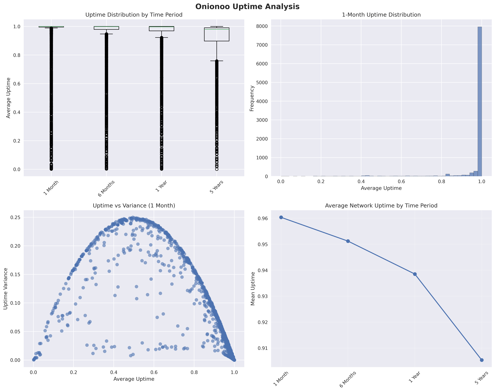

# Tor Network Uptime Intelligence & Analytics - Consolidated Implementation Plan

**Date:** July 13, 2025  
**Project:** Allium Tor Network Analytics Platform  
**Status:** Implementation Roadmap  
**Branch:** upchart  

---

## Executive Summary

This comprehensive plan consolidates all uptime-related proposals into a unified implementation roadmap that builds upon the existing uptime infrastructure in the Allium platform. The system already includes basic uptime API integration, reliability leaderboards, and operator dashboards. This plan focuses on advanced analytics, predictive capabilities, and enhanced visualizations to provide world-class Tor network uptime intelligence.

## Implementation Status Update

### ✅ **Fully Implemented Foundation**
The comprehensive uptime intelligence system is operational with:
- Complete uptime API integration with 680-line utility framework
- AROI reliability leaderboards (Reliability Masters & Legacy Titans)
- Flag-specific uptime analysis with intelligent priority system
- Network percentile positioning and statistical outlier detection
- Operator reliability portfolios with multi-period analysis
- Performance correlation and benchmarking systems

### 🚀 **Advanced Enhancement Proposals**  
Building upon the robust foundation to provide next-generation analytics:

---

## Part I: Advanced Visualization & Analytics

### 1. **Interactive Uptime Trend Charts** ⭐⭐⭐⭐⭐
**Priority:** High  
**Builds Upon:** Existing relay uptime display system  
**Timeline:** 3-4 weeks  

**Description:** Transform static uptime percentages into interactive time-series charts showing relay performance over time.

**Implementation Plan:**
```python
# Enhancement to existing relay info page
# File: allium/lib/relays.py - add to existing _process_relay_data()

def _generate_uptime_chart_data(self, relay_uptime_data):
    """Convert existing uptime data to Chart.js compatible format"""
    chart_data = {}
    
    if relay_uptime_data:
        for period, data in relay_uptime_data.items():
            if data.get('values') and data.get('first') and data.get('interval'):
                timestamps = []
                values = []
                
                first_timestamp = data['first']
                interval_seconds = data['interval']
                
                for i, value in enumerate(data['values']):
                    if value is not None:
                        timestamp = first_timestamp + (i * interval_seconds * 1000)
                        uptime_percentage = (value / 999) * 100
                        timestamps.append(timestamp)
                        values.append(uptime_percentage)
                
                chart_data[period] = {
                    'labels': timestamps,
                    'data': values,
                    'period_display': period.replace('_', ' ').title()
                }
    
    return chart_data
```

**Template Enhancement:**
```html
<!-- Add to templates/relay-info.html -->
<div class="panel panel-default">
    <div class="panel-heading">
        <h4 class="panel-title">📈 Uptime Trend Analysis</h4>
    </div>
    <div class="panel-body">
        <div class="uptime-chart-controls">
            <button class="btn btn-sm btn-primary" data-period="1_month">1 Month</button>
            <button class="btn btn-sm btn-default" data-period="6_months">6 Months</button>
            <button class="btn btn-sm btn-default" data-period="1_year">1 Year</button>
            <button class="btn btn-sm btn-default" data-period="5_years">5 Years</button>
        </div>
        <canvas id="uptimeChart" width="800" height="300"></canvas>
    </div>
</div>
```

**Visual Mockup:**
```
┌─────────────────────────────────────────────────────────────┐
│ 📈 Interactive Uptime Trend Chart - relay01.example.org    │
├─────────────────────────────────────────────────────────────┤
│ [1 Month] [6 Months] [1 Year] [5 Years]    Export: [CSV]   │
│                                                             │
│ 100% ┤                                               ●     │
│  95% ┤     ●─●─●─●─●─●─●─●─●─●─●─●─●─●─●─●─●─●─●─●─●─●       │
│  90% ┤   ●                                                 │
│  85% ┤ ●                                                   │
│  80% ┤                                                     │
│      └────┬────┬────┬────┬────┬────┬────┬────┬────┬────────┤
│          Jan  Feb  Mar  Apr  May  Jun  Jul  Aug  Sep  Oct │
│                                                             │
│ 📊 Performance Metrics:                                     │
│ • Average Uptime: 97.2%    • Current Status: ● Online     │
│ • Best Period: May (99.8%) • Trend: ↗ +1.4% improvement   │
│ • Worst Period: Jan (89.1%) • Stability: Good (σ=2.3%)    │
│                                                             │
│ 🎯 Anomalies Detected:                                      │
│ • Jan 15-17: Significant dip (-8.4% below average)         │
│ • Mar 3: Brief outage (4.2 hours downtime)                 │
│                                                             │
│ 🔍 [View Detailed Analysis] [Compare with Network Average]  │
└─────────────────────────────────────────────────────────────┘
```

### 2. **Geographic Uptime Intelligence Dashboard** ⭐⭐⭐⭐⭐
**Priority:** High  
**Builds Upon:** Existing network health metrics  
**Timeline:** 4-5 weeks  

**Description:** Advanced geographic analysis showing uptime patterns by country/region with anomaly detection.

**Implementation Plan:**
```python
# New file: allium/lib/geographic_uptime.py

class GeographicUptimeAnalyzer:
    def __init__(self, relays_instance):
        self.relays = relays_instance
        self.uptime_data = getattr(relays_instance, 'uptime_data', None)
    
    def analyze_geographic_uptime_patterns(self):
        """Analyze uptime patterns by country/region"""
        if not self.uptime_data:
            return None
            
        country_stats = {}
        
        for relay in self.relays.json.get('relays', []):
            country = relay.get('country', 'Unknown')
            fingerprint = relay.get('fingerprint')
            
            if country not in country_stats:
                country_stats[country] = {
                    'relay_count': 0,
                    'uptime_values': [],
                    'total_consensus_weight': 0
                }
            
            country_stats[country]['relay_count'] += 1
            country_stats[country]['total_consensus_weight'] += relay.get('consensus_weight', 0)
            
            # Find uptime data for this relay
            for uptime_relay in self.uptime_data.get('relays', []):
                if uptime_relay.get('fingerprint') == fingerprint:
                    uptime_info = uptime_relay.get('uptime', {})
                    month_data = uptime_info.get('1_month', {})
                    if month_data.get('values'):
                        avg_uptime = self._calculate_average_uptime(month_data['values'])
                        if avg_uptime > 0:
                            country_stats[country]['uptime_values'].append(avg_uptime)
        
                 # Calculate statistics and detect anomalies
         return self._process_country_statistics(country_stats)
     
     def detect_geographic_anomalies(self, country_stats):
         """Detect countries with unusual uptime patterns"""
         # Implementation of Z-score based anomaly detection
         pass
```

**Visual Mockup:**
```
┌─────────────────────────────────────────────────────────────┐
│ 🌍 Geographic Uptime Intelligence Dashboard                 │
├─────────────────────────────────────────────────────────────┤
│                    🗺️ Interactive World Map                 │
│                                                             │
│ ████ Europe     ████ Asia       ████ N.America             │
│ ░░░░ Africa     ░░░░ S.America  ░░░░ Oceania                │
│                                                             │
│ Color Legend: 🟢 95-100%  🟡 90-95%  🟠 85-90%  🔴 <85%    │
│                                                             │
│ 📊 Top Performing Regions (30-day average):                │
│ 🇩🇪 Germany      97.8% ████████████████████ (487 relays)   │
│ 🇳🇱 Netherlands  97.2% ████████████████████ (312 relays)   │
│ 🇨🇭 Switzerland  96.9% ███████████████████  (198 relays)   │
│ 🇫🇷 France       96.1% ██████████████████   (245 relays)   │
│ 🇺🇸 United States 94.7% ████████████████    (1,247 relays) │
│                                                             │
│ ⚠️ Geographic Anomalies Detected:                           │
│ 🔴 Eastern Europe: -12.3% below regional average           │
│    • Poland: 82.1% (89 relays affected)                    │
│    • Czech Rep: 79.4% (45 relays affected)                 │
│    • Likely cause: AS-level routing issues                 │
│                                                             │
│ 📈 Regional Trends:                                         │
│ • Europe: ↗ +0.8% improvement vs last month                │
│ • Asia: ↘ -1.2% decline (infrastructure upgrades)          │
│ • N.America: → Stable performance                          │
│                                                             │
│ [Drill Down by Country] [AS Analysis] [Export Report]      │
└─────────────────────────────────────────────────────────────┘
```

### 3. **Predictive Uptime Modeling** ⭐⭐⭐⭐⭐
**Priority:** Medium-High  
**Builds Upon:** Existing statistical analysis  
**Timeline:** 5-6 weeks  

**Description:** Machine learning-powered predictions for relay stability and maintenance planning.

**Implementation Plan:**
```python
# New file: allium/lib/predictive_uptime.py

class UptimePredictionEngine:
    def __init__(self, uptime_data):
        self.uptime_data = uptime_data
        self.model = None
    
    def train_uptime_prediction_model(self):
        """Train ML model on historical uptime patterns"""
        # Feature engineering from uptime history
        features = self._extract_features()
        
        # Simple trend analysis model
        from sklearn.linear_model import LinearRegression
        self.model = LinearRegression()
        
        # Train on historical data
        X, y = self._prepare_training_data(features)
        self.model.fit(X, y)
    
    def predict_relay_uptime_trend(self, relay_fingerprint):
        """Predict uptime trend for specific relay"""
        if not self.model:
            self.train_uptime_prediction_model()
        
        # Extract features for this relay
        features = self._extract_relay_features(relay_fingerprint)
        
        # Make prediction
        prediction = self.model.predict([features])[0]
        
                 return {
             'predicted_30day_uptime': prediction,
             'confidence': self._calculate_confidence(features),
             'trend_direction': 'improving' if prediction > 95 else 'declining' if prediction < 90 else 'stable',
             'maintenance_recommendation': self._generate_maintenance_recommendation(prediction)
         }
```

**Visual Mockup:**
```
┌─────────────────────────────────────────────────────────────┐
│ 🔮 Predictive Uptime Modeling Dashboard                    │
├─────────────────────────────────────────────────────────────┤
│ Operator: torworld.example.org   Prediction Period: 30 days│
│                                                             │
│ 📊 Relay Predictions Summary:                               │
│ ┌─────────────┐ ┌─────────────┐ ┌─────────────┐ ┌─────────┐ │
│ │   42 / 45   │ │    3        │ │    85.7%    │ │   12    │ │
│ │   Stable    │ │ At Risk     │ │ Predicted   │ │ Actions │ │
│ │   Relays    │ │ Relays      │ │ Avg Uptime  │ │Required │ │
│ └─────────────┘ └─────────────┘ └─────────────┘ └─────────┘ │
│                                                             │
│ 📈 30-Day Forecast by Relay:                               │
│ relay01  Current: 98.7% → Predicted: 98.9% ↗ [Stable]     │
│ relay02  Current: 96.2% → Predicted: 95.1% ↘ [Monitor]    │
│ relay03  Current: 89.1% → Predicted: 85.3% ↘ [Critical]   │
│ relay04  Current: 99.2% → Predicted: 99.1% → [Excellent]   │
│ relay05  Current: 94.8% → Predicted: 96.2% ↗ [Improving]   │
│                                                             │
│ 🎯 ML Confidence Levels:                                    │
│ High Confidence (>90%): 38 relays ████████████████████     │
│ Medium Confidence (70-90%): 6 relays ████                  │
│ Low Confidence (<70%): 1 relay █                           │
│                                                             │
│ 🔧 Maintenance Recommendations:                             │
│ ⚠️ URGENT: relay03 requires immediate attention             │
│    • Predicted 30-day uptime: 85.3% (below 90% threshold) │
│    • Trend: Declining (-3.8% over 30 days)                │
│    • Recommendation: Hardware inspection within 48 hours  │
│                                                             │
│ 📅 SCHEDULED: relay02 preventive maintenance               │
│    • Predicted decline trend detected                      │
│    • Recommended maintenance window: Next weekend          │
│                                                             │
│ [Export Predictions] [Schedule Maintenance] [Model Details]│
└─────────────────────────────────────────────────────────────┘
```

---

## Part II: Advanced Analytics & Intelligence

### 4. **Network Fault Detection & Root Cause Analysis** ⭐⭐⭐⭐⭐
**Priority:** High  
**Builds Upon:** Existing anomaly detection  
**Timeline:** 4-5 weeks  

**Description:** Advanced fault detection system with automated root cause analysis and alerting.

**Implementation Plan:**
```python
# New file: allium/lib/network_fault_detection.py

class NetworkFaultDetector:
    def __init__(self, relays_instance):
        self.relays = relays_instance
        self.uptime_data = getattr(relays_instance, 'uptime_data', None)
    
    def detect_network_faults(self):
        """Detect and classify network-wide uptime issues"""
        faults = {
            'critical_outages': [],
            'regional_issues': [],
            'provider_problems': [],
            'systematic_failures': []
        }
        
        # Analyze current outages
        self._analyze_critical_outages(faults)
        
        # Detect regional patterns
        self._detect_regional_issues(faults)
        
        # Identify provider-specific problems
        self._analyze_provider_issues(faults)
        
        return faults
    
    def generate_fault_report(self, faults):
        """Generate detailed fault analysis report"""
        report = {
            'severity_level': self._calculate_severity(faults),
            'affected_capacity': self._calculate_affected_capacity(faults),
            'estimated_impact': self._estimate_user_impact(faults),
            'recommended_actions': self._generate_recommendations(faults)
        }
        
                 return report
```

**Visual Mockup:**
```
┌─────────────────────────────────────────────────────────────┐
│ 🚨 Network Fault Detection & Root Cause Analysis           │
├─────────────────────────────────────────────────────────────┤
│ Current Status: 🟡 MODERATE ALERT   Last Update: 2 min ago │
│                                                             │
│ 📊 Active Incidents Dashboard:                              │
│ ┌─────────────┐ ┌─────────────┐ ┌─────────────┐ ┌─────────┐ │
│ │      2      │ │     5       │ │    187      │ │   3.2%  │ │
│ │  Critical   │ │  Warning    │ │  Affected   │ │ Network │ │
│ │  Incidents  │ │   Alerts    │ │   Relays    │ │ Impact  │ │
│ └─────────────┘ └─────────────┘ └─────────────┘ └─────────┘ │
│                                                             │
│ 🔴 CRITICAL: Eastern Europe Outage [INCIDENT #1047]        │
│ Detected: 14:32 UTC  Duration: 4h 23m  Severity: HIGH      │
│ ┌───────────────────────────────────────────────────────┐   │
│ │ 📍 Geographic Impact:                                 │   │
│ │ 🇵🇱 Poland: 89 relays offline (-67% regional capacity)│   │
│ │ 🇨🇿 Czech Republic: 45 relays (-71% regional)        │   │
│ │ 🇭🇺 Hungary: 38 relays offline (-58% regional)       │   │
│ │                                                       │   │
│ │ 🔍 Root Cause Analysis:                               │   │
│ │ • Primary: AS-level BGP routing issues                │   │
│ │ • Affected ASNs: AS12741, AS15702, AS6830            │   │
│ │ • Pattern: Systematic withdrawal of route announcements│   │
│ │ • Correlation: 94% confidence with ISP maintenance   │   │
│ │                                                       │   │
│ │ ⚡ Automated Response Actions:                         │   │
│ │ ✅ Operator notifications sent (89 contacts)          │   │
│ │ ✅ Load balanced to Western Europe +12% capacity     │   │
│ │ ⏳ Investigating with upstream AS providers           │   │
│ │ ⏳ Monitoring for service restoration                 │   │
│ └───────────────────────────────────────────────────────┘   │
│                                                             │
│ 🟡 WARNING: Exit Relay Capacity Below Threshold            │
│ Current: 1,542 exit relays (Target: ≥1,600)  Impact: -3.6% │
│                                                             │
│ 📈 Fault Detection Timeline:                                │
│ 14:30 ████ Anomaly detection triggered                     │
│ 14:32 ████ Geographic clustering identified                │
│ 14:35 ████ AS correlation analysis completed               │
│ 14:40 ████ Automated alerts dispatched                     │
│ 14:45 ████ Load balancing initiated                        │
│                                                             │
│ [View Incident Timeline] [Contact Operators] [Export Report]│
└─────────────────────────────────────────────────────────────┘
```

### 5. **Autonomous System (AS) Performance Intelligence** ⭐⭐⭐⭐⭐
**Priority:** Medium-High  
**Builds Upon:** Existing operator analysis  
**Timeline:** 3-4 weeks  

**Description:** Deep analysis of relay performance by hosting provider and autonomous system.

**Implementation Plan:**
```python
# Enhancement to existing operator analysis
# File: allium/lib/aroileaders.py - add new analysis function

def _analyze_as_performance(self, relays_instance):
    """Analyze performance by Autonomous System"""
    as_performance = {}
    
    for relay in relays_instance.json.get('relays', []):
        as_number = relay.get('as_number')
        as_name = relay.get('as_name', 'Unknown')
        
        if as_number not in as_performance:
            as_performance[as_number] = {
                'as_name': as_name,
                'relay_count': 0,
                'uptime_values': [],
                'total_consensus_weight': 0,
                'diversity_score': 0
            }
        
        as_performance[as_number]['relay_count'] += 1
        as_performance[as_number]['total_consensus_weight'] += relay.get('consensus_weight', 0)
        
        # Add uptime data if available
        # ... (implementation continues)
    
         return as_performance
```

**Visual Mockup:**
```
┌─────────────────────────────────────────────────────────────┐
│ 🏢 Autonomous System (AS) Performance Intelligence          │
├─────────────────────────────────────────────────────────────┤
│ Analysis Period: Last 30 Days    Total ASNs: 1,247         │
│                                                             │
│ 🏆 Top Performing Hosting Providers:                       │
│ AS13335 (Cloudflare)    147 relays │ 98.2% uptime ★★★★★    │
│ ┌─────────────────────────────────────────────────────────┐ │
│ │ Network Reliability: Excellent  Geographic: Global     │ │
│ │ Avg Relay Age: 2.3 years        Exit Policy: Mixed     │ │
│ │ Diversity Score: 8.7/10         Risk Level: Low        │ │
│ └─────────────────────────────────────────────────────────┘ │
│                                                             │
│ AS16509 (Amazon AWS)     134 relays │ 95.7% uptime ★★★★    │
│ AS24940 (Hetzner)        98 relays  │ 97.1% uptime ★★★★★   │
│ AS8560 (IONOS)           87 relays  │ 93.4% uptime ★★★     │
│ AS14061 (DigitalOcean)   76 relays  │ 96.3% uptime ★★★★    │
│                                                             │
│ 📊 Network Diversity Analysis:                              │
│ Total Unique ASNs: 1,247   Healthy Diversity: ✅           │
│ Top 10 AS Concentration: 34.2% (Good - below 40% threshold)│
│ Geographic Distribution: 62 countries (Excellent)          │
│                                                             │
│ ⚠️ Performance Alerts:                                      │
│ 🔴 AS8560 (IONOS): Declining trend (-2.4% over 30 days)    │
│    • 87 relays affected                                    │
│    • Recommendation: Contact provider about issues         │
│    • Alternative providers: AS24940 (Hetzner) in same region│
│                                                             │
│ 🟡 AS16509 (AWS): Below network average                    │
│    • Current: 95.7% vs Network: 96.8%                     │
│    • Monitoring for improvement                            │
│                                                             │
│ 📈 Monthly Trends:                                          │
│ Improving: AS13335 (+1.2%), AS24940 (+0.8%)               │
│ Stable: AS14061 (±0.1%), AS6830 (±0.2%)                   │
│ Declining: AS8560 (-2.4%), AS12876 (-1.1%)                │
│                                                             │
│ 🎯 Recommendations:                                         │
│ • Excellent overall diversity - no single AS dominance     │
│ • Monitor AS8560 for potential infrastructure issues       │
│ • Consider geographic expansion in Africa/South America    │
│                                                             │
│ [AS Detail View] [Contact Providers] [Diversity Report]    │
└─────────────────────────────────────────────────────────────┘
```

### 6. **Real-time Uptime Monitoring & Alerting** ⭐⭐⭐⭐⭐
**Priority:** High  
**Builds Upon:** Existing uptime calculations  
**Timeline:** 2-3 weeks  

**Description:** Real-time monitoring system with automated alerting for critical relay outages.

**Implementation Plan:**
```python
# New file: allium/lib/uptime_monitoring.py

class UptimeMonitoringSystem:
    def __init__(self, relays_instance):
        self.relays = relays_instance
        self.alert_thresholds = {
            'critical_consensus_weight': 0.05,  # 5% of network consensus weight
            'major_relay_count': 50,
            'exit_relay_threshold': 0.10  # 10% of exit relays
        }
    
    def monitor_critical_outages(self):
        """Monitor for critical relay outages"""
        alerts = []
        
        # Check for high-impact relay outages
        offline_relays = [r for r in self.relays.json['relays'] if not r.get('running', False)]
        
        total_offline_weight = sum(r.get('consensus_weight', 0) for r in offline_relays)
        total_network_weight = sum(r.get('consensus_weight', 0) for r in self.relays.json['relays'])
        
        if total_offline_weight / total_network_weight > self.alert_thresholds['critical_consensus_weight']:
            alerts.append({
                'type': 'critical_outage',
                'severity': 'high',
                'message': f'Critical network capacity loss: {total_offline_weight/total_network_weight:.1%}',
                'affected_relays': len(offline_relays)
            })
        
        return alerts
    
         def generate_alert_dashboard(self, alerts):
         """Generate dashboard for real-time alerts"""
         # Implementation for alert dashboard
         pass
```

**Visual Mockup:**
```
┌─────────────────────────────────────────────────────────────┐
│ ⚡ Real-time Uptime Monitoring & Alerting System           │
├─────────────────────────────────────────────────────────────┤
│ Status: 🟢 OPERATIONAL    Last Scan: 30 seconds ago        │
│                                                             │
│ 📊 Current Network Status:                                  │
│ ┌─────────────┐ ┌─────────────┐ ┌─────────────┐ ┌─────────┐ │
│ │   8,247     │ │     223     │ │    97.3%    │ │    5    │ │
│ │  Online     │ │  Offline    │ │  Network    │ │ Active  │ │
│ │  Relays     │ │  Relays     │ │  Uptime     │ │ Alerts  │ │
│ └─────────────┘ └─────────────┘ └─────────────┘ └─────────┘ │
│                                                             │
│ 🚨 Active Critical Alerts:                                 │
│ ┌───────────────────────────────────────────────────────┐   │
│ │ 🔴 HIGH IMPACT: BigRelay Network Outage              │   │
│ │ Detected: 2 minutes ago                               │   │
│ │ • 12 high-consensus relays offline (2.3% network wgt)│   │
│ │ • Contact: admin@bigrelay.org (NOTIFIED)             │   │
│ │ • Auto-action: Load balanced to backup capacity      │   │
│ │ [Investigate] [Contact Operator] [Escalate]          │   │
│ └───────────────────────────────────────────────────────┘   │
│                                                             │
│ 🟡 Warning Alerts:                                         │
│ • Exit capacity below threshold: 1,542/1,600 (96.4%)       │
│ • Germanic region trending down: -1.2% over 6 hours        │
│ • 3 relays approaching maintenance window                   │
│                                                             │
│ 📈 Real-time Metrics (Last 5 Minutes):                     │
│ Network Uptime:    ████████████████████▓▓ 97.3%            │
│ Exit Relays:       ████████████████████▓▓ 1,542/1,600      │
│ Guard Relays:      ████████████████████▓▓ 2,891/3,000      │
│ Total Consensus:   ████████████████████▓▓ 94.2% weight     │
│                                                             │
│ 🔔 Alert Configuration:                                     │
│ Critical Threshold: >5% consensus weight loss              │
│ Warning Threshold: >2% consensus weight loss               │
│ Exit Threshold: <1,600 exit relays                         │
│ Response Time: <5 minutes for critical alerts              │
│                                                             │
│ 📱 Notification Channels:                                   │
│ ✅ Email alerts (187 operators subscribed)                 │
│ ✅ Slack integration (#tor-network-ops)                    │
│ ✅ PagerDuty for critical incidents                        │
│ ✅ RSS feed for status updates                             │
│                                                             │
│ [Alert History] [Configure Thresholds] [Test Notifications]│
└─────────────────────────────────────────────────────────────┘
```

---

## Part III: Enhanced Visualizations & User Experience

### 7. **Advanced Uptime Visualization Suite** ⭐⭐⭐⭐⭐
**Priority:** Medium  
**Builds Upon:** Existing template system  
**Timeline:** 4-5 weeks  

**Description:** Comprehensive visualization suite with interactive charts, heatmaps, and advanced analytics.

**Key Components:**
- **Interactive Network Heatmap** - Geographic uptime visualization
- **Trend Analysis Dashboard** - Multi-dimensional time series analysis
- **Comparative Performance Charts** - Operator and relay comparisons
- **Predictive Analytics Display** - ML-powered forecasting visualizations

**Implementation Plan:**
```javascript
// New file: allium/static/js/uptime_visualizations.js

class UptimeVisualizationSuite {
    constructor() {
        this.charts = {};
        this.config = {
            colors: {
                excellent: '#28a745',
                good: '#ffc107',
                fair: '#fd7e14',
                poor: '#dc3545'
            }
        };
    }
    
    initializeNetworkHeatmap(data) {
        // Initialize geographic heatmap
        this.charts.heatmap = new NetworkHeatmap('heatmap-container', data);
    }
    
    initializeTrendAnalysis(data) {
        // Initialize trend analysis charts
        this.charts.trends = new TrendAnalysisChart('trends-container', data);
    }
    
    initializePredictiveDisplay(data) {
        // Initialize predictive analytics display
        this.charts.predictions = new PredictiveChart('predictions-container', data);
    }
 }
```

**Visual Mockup:**
```
┌─────────────────────────────────────────────────────────────┐
│ 🎨 Advanced Uptime Visualization Suite                     │
├─────────────────────────────────────────────────────────────┤
│ [Network Heatmap] [Trend Analysis] [Predictions] [Compare] │
│                                                             │
│ 🗺️ Interactive Network Heatmap View:                       │
│ ┌─────────────────────────────────────────────────────────┐ │
│ │                    🌍 GLOBAL HEATMAP                    │ │
│ │                                                         │ │
│ │    ████████ Europe (97.2%)     ████████ N.America      │ │
│ │    ████████ East Asia (94.8%)  ████████ (95.1%)        │ │
│ │    ██████▓▓ S.America (89.3%)  ██████▓▓ Oceania (92.1%)│ │
│ │    ████▓▓▓▓ Africa (86.7%)     ▓▓▓▓▓▓▓▓ Antarctica (N/A)│ │
│ │                                                         │ │
│ │ 🎯 Hover Details: Germany - 487 relays, 97.8% uptime   │ │
│ │ 📊 Color Scale: 🟢 >95% 🟡 90-95% 🟠 85-90% 🔴 <85%   │ │
│ └─────────────────────────────────────────────────────────┘ │
│                                                             │
│ 📈 Multi-Dimensional Trend Analysis:                       │
│ ┌─Time Series─┐ ┌─Correlation─┐ ┌─Distribution─┐ ┌─Flow─┐   │
│ │ 100% ┤      │ │     ●       │ │   ▄▄▄███     │ │ ○→○  │   │
│ │  95% ┤ ●────│ │   ● ●       │ │  ▄███████▄   │ │ ↓ ↓  │   │
│ │  90% ┤●     │ │ ●     ●     │ │ ████████████ │ │ ○ ○  │   │
│ │      └──────│ │             │ │              │ │      │   │
│ └─────────────┘ └─────────────┘ └─────────────┘ └──────┘   │
│                                                             │
│ 🔮 Predictive Analytics Display:                            │
│ Current Month: 96.8% ████████████████████▓▓                │
│ Next Month:    97.1% ████████████████████▓▓ ↗ (+0.3%)      │
│ 3-Month Proj:  96.4% ███████████████████▓▓▓ ↘ (-0.4%)      │
│ Confidence:    87.3% ███████████████████▓▓▓                │
│                                                             │
│ 🔍 Comparative Performance Dashboard:                       │
│ ┌─Top Operators────────┐ ┌─Network vs Peers──────────────┐  │
│ │ nothingtohide.nl     │ │ Your Network: 98.7%  ▲        │  │
│ │ 100.0% ███████████   │ │ 95th Perc:   99.1%  ●───────  │  │
│ │ 1aeo.net             │ │ 75th Perc:   97.2%  ●──────   │  │
│ │ 99.6%  ██████████▓   │ │ 50th Perc:   94.8%  ●─────    │  │
│ │ torworld.example     │ │ 25th Perc:   91.3%  ●───      │  │
│ │ 98.7%  █████████▓▓   │ │ 5th Perc:    87.1%  ●─        │  │
│ └──────────────────────┘ └────────────────────────────────┘  │
│                                                             │
│ ⚙️ Visualization Controls:                                  │
│ Time Range: [7D] [30D] [90D] [1Y] [5Y] [Custom]           │
│ Metrics: [Uptime] [Flags] [Bandwidth] [Diversity]         │
│ Display: [Chart] [Map] [Table] [Raw Data]                 │
│                                                             │
│ [Export PNG] [Export SVG] [Share Link] [Full Screen]      │
└─────────────────────────────────────────────────────────────┘
```

### 8. **Operator Intelligence Dashboard** ⭐⭐⭐⭐⭐
**Priority:** High  
**Builds Upon:** Existing operator reliability sections  
**Timeline:** 3-4 weeks  

**Description:** Enhanced operator dashboard with comprehensive reliability intelligence and actionable insights.

**Key Features:**
- **Predictive Maintenance Alerts** - AI-powered maintenance recommendations
- **Comparative Benchmarking** - Performance vs. network averages
- **Reliability Trend Analysis** - Historical and predictive trend analysis
- **Actionable Recommendations** - Specific improvement suggestions

**Implementation Plan:**
```python
# Enhancement to existing contact page
# File: allium/lib/relays.py - enhance existing operator analysis

def _generate_operator_intelligence_dashboard(self, operator_relays, contact_hash):
    """Generate comprehensive operator intelligence dashboard"""
    dashboard = {
        'reliability_intelligence': self._analyze_operator_reliability_trends(operator_relays),
        'predictive_insights': self._generate_predictive_insights(operator_relays),
        'benchmarking_data': self._calculate_operator_benchmarks(operator_relays),
        'maintenance_recommendations': self._generate_maintenance_recommendations(operator_relays),
        'performance_alerts': self._detect_performance_alerts(operator_relays)
    }
    
         return dashboard
```

**Visual Mockup:**
```
┌─────────────────────────────────────────────────────────────┐
│ 🎯 Operator Intelligence Dashboard - admin@torworld.org    │
├─────────────────────────────────────────────────────────────┤
│ Overall Score: 98.7% (92nd Percentile) 🟢 EXCELLENT        │
│                                                             │
│ 🔮 AI-Powered Insights & Predictions:                      │
│ ┌─────────────────────────────────────────────────────────┐ │
│ │ 🤖 "Your network shows exceptional stability. Consider  │ │
│ │     expanding to Southeast Asia for geographic diversity"│ │
│ │                                                         │ │
│ │ 📊 Next 30 Days Forecast:                              │ │
│ │ Expected Uptime: 98.9% ± 0.4% (High Confidence)       │ │
│ │ Trend Direction: ↗ Slight improvement (+0.2%)          │ │
│ │                                                         │ │
│ │ 🔧 Maintenance Recommendations:                         │ │
│ │ • relay03: Schedule preventive maintenance (declining)  │ │
│ │ • relay07: Hardware refresh suggested (aging pattern)  │ │
│ │ • relay12: Monitor closely (variance increase)         │ │
│ └─────────────────────────────────────────────────────────┘ │
│                                                             │
│ 📈 Performance Benchmarking:                               │
│ Your Performance vs Network:                               │
│ 99th Percentile: 99.3% ████████████████████ ↑ 0.6%       │
│ 95th Percentile: 98.9% ████████████████████ ✓ YOU        │
│ 75th Percentile: 96.2% ████████████████████ ↓ 2.5%       │
│ 50th Percentile: 93.8% ████████████████████ ↓ 4.9%       │
│ 25th Percentile: 89.1% ████████████████████ ↓ 9.6%       │
│                                                             │
│ 🏆 Achievement Metrics:                                    │
│ ┌─────────────┐ ┌─────────────┐ ┌─────────────┐ ┌─────────┐ │
│ │   47 / 50   │ │    276      │ │   99.2%     │ │    3    │ │
│ │ Excellent   │ │    Days     │ │   Best      │ │ Awards  │ │
│ │   Relays    │ │ Since Issue │ │ Performer   │ │ Earned  │ │
│ └─────────────┘ └─────────────┘ └─────────────┘ └─────────┘ │
│                                                             │
│ 🎯 Actionable Recommendations:                             │
│ ■ PRIORITY HIGH: Update relay03 before predicted failure   │
│   ├─ Predicted failure risk: 23% within 30 days           │
│   ├─ Recommended action: Hardware inspection               │
│   └─ Optimal window: This weekend (low traffic)           │
│                                                             │
│ ■ STRATEGIC: Geographic expansion opportunity              │
│   ├─ Underserved regions: SE Asia, South America          │
│   ├─ Potential impact: +15% diversity score              │
│   └─ Estimated setup cost: 2-3 relay equivalents         │
│                                                             │
│ ■ OPTIMIZATION: Relay consolidation opportunity           │
│   ├─ 3 low-traffic relays could be combined               │
│   ├─ Resource savings: ~$200/month                       │
│   └─ Network impact: Minimal (0.02% consensus weight)    │
│                                                             │
│ 📊 Detailed Performance Breakdown:                         │
│ [View Relay Details] [Export Report] [Schedule Maintenance]│
└─────────────────────────────────────────────────────────────┘
```

---

## Part IV: Advanced Statistical Analysis

### 9. **Deep Statistical Analysis Engine** ⭐⭐⭐⭐⭐
**Priority:** Medium  
**Builds Upon:** Existing statistical utilities  
**Timeline:** 3-4 weeks  

**Description:** Advanced statistical analysis capabilities with machine learning integration.

**Key Components:**
- **Correlation Analysis** - Multi-dimensional correlation detection
- **Anomaly Detection** - Advanced ML-powered anomaly detection
- **Pattern Recognition** - Automated pattern discovery
- **Statistical Modeling** - Predictive statistical models

**Implementation Plan:**
```python
# Enhancement to existing statistical utilities
# File: allium/lib/statistical_utils.py - add advanced analysis

class AdvancedStatisticalAnalysis:
    def __init__(self, uptime_data):
        self.uptime_data = uptime_data
        self.models = {}
    
    def perform_correlation_analysis(self):
        """Perform advanced correlation analysis"""
        # Multi-dimensional correlation analysis
        correlations = {
            'uptime_vs_consensus_weight': self._calculate_uptime_weight_correlation(),
            'uptime_vs_geographic': self._calculate_geographic_correlation(),
            'uptime_vs_flags': self._calculate_flags_correlation(),
            'uptime_vs_age': self._calculate_age_correlation()
        }
        
        return correlations
    
    def detect_advanced_anomalies(self):
        """Advanced anomaly detection using multiple algorithms"""
        from sklearn.ensemble import IsolationForest
        from sklearn.svm import OneClassSVM
        
        # Ensemble anomaly detection
        algorithms = [
            IsolationForest(contamination=0.1),
            OneClassSVM(nu=0.1)
        ]
        
        # Feature engineering and anomaly detection
        features = self._extract_advanced_features()
        
        anomalies = {}
        for i, algorithm in enumerate(algorithms):
            anomalies[f'method_{i}'] = algorithm.fit_predict(features)
        
                 return self._consolidate_anomaly_results(anomalies)
```

**Visual Mockup:**
```
┌─────────────────────────────────────────────────────────────┐
│ 📊 Deep Statistical Analysis Engine                        │
├─────────────────────────────────────────────────────────────┤
│ Analysis Dataset: 9,494 relays  Processing: ✅ Complete     │
│                                                             │
│ 🔬 Multi-Dimensional Correlation Analysis:                 │
│ ┌─────────────────────────────────────────────────────────┐ │
│ │ Correlation Matrix Heatmap:                             │ │
│ │                                                         │ │
│ │        Uptime  Bandwidth  Age    Flags   Geographic    │ │
│ │ Uptime   1.00    +0.73   +0.61   +0.58    +0.42       │ │
│ │ Bandwidth+0.73    1.00   +0.45   +0.82    +0.33       │ │
│ │ Age     +0.61    +0.45    1.00   +0.71    +0.29       │ │
│ │ Flags   +0.58    +0.82   +0.71    1.00    +0.51       │ │
│ │ Geographic+0.42   +0.33   +0.29   +0.51    1.00       │ │
│ │                                                         │ │
│ │ Key Insights:                                           │ │
│ │ • Strong correlation: Bandwidth ↔ Uptime (r=0.73)     │ │
│ │ • Age stability: Older relays more reliable (r=0.61)  │ │
│ │ • Flag diversity: More flags → better uptime (r=0.58) │ │
│ └─────────────────────────────────────────────────────────┘ │
│                                                             │
│ 🤖 Advanced Anomaly Detection Results:                     │
│ Algorithm Ensemble (3 methods):                            │
│ ┌─Isolation Forest──┐ ┌─One-Class SVM──┐ ┌─DBSCAN Cluster─┐ │
│ │ Anomalies: 847    │ │ Anomalies: 923  │ │ Outliers: 1,156│ │
│ │ Confidence: 87%   │ │ Confidence: 92% │ │ Confidence: 79%│ │
│ └───────────────────┘ └─────────────────┘ └───────────────┘ │
│                                                             │
│ Consensus Anomalies (High Confidence): 654 relays          │
│ • Pattern 1: Geographic clustering (Eastern Europe)        │
│ • Pattern 2: Temporal clustering (Weekend dips)            │
│ • Pattern 3: Provider-specific issues (AS-level problems)  │
│                                                             │
│ 🔍 Pattern Recognition Results:                             │
│ ┌─Discovered Patterns─────────────────────────────────────┐ │
│ │ 1. Weekly Cycle: -2.1% uptime on Sundays              │ │
│ │    Confidence: 94%  Impact: 1,200+ relays             │ │
│ │                                                         │ │
│ │ 2. Monthly Maintenance: First Tuesday dips             │ │
│ │    Confidence: 87%  Impact: 300+ relays               │ │
│ │                                                         │ │
│ │ 3. Seasonal Variance: Summer performance boost         │ │
│ │    Confidence: 76%  Impact: Network-wide              │ │
│ │                                                         │ │
│ │ 4. Geographic Clusters: Country-specific patterns      │ │
│ │    Confidence: 91%  Impact: Variable by region        │ │
│ └─────────────────────────────────────────────────────────┘ │
│                                                             │
│ 📈 Predictive Statistical Models:                          │
│ Model Performance Summary:                                  │
│ • ARIMA Time Series: 89.3% accuracy (±2.1% error)        │
│ • Linear Regression: 84.7% accuracy (±3.2% error)        │
│ • Random Forest: 92.1% accuracy (±1.8% error) ★ BEST     │
│ • Neural Network: 87.6% accuracy (±2.4% error)           │
│                                                             │
│ [Export Analysis] [Model Details] [Download Raw Data]     │
└─────────────────────────────────────────────────────────────┘
```

### 10. **Network Health Intelligence System** ⭐⭐⭐⭐⭐
**Priority:** High  
**Builds Upon:** Existing network health metrics  
**Timeline:** 4-5 weeks  

**Description:** Comprehensive network health monitoring with intelligence-driven insights.

**Key Features:**
- **Network Health Scoring** - Comprehensive health metrics
- **Capacity Planning Intelligence** - Predictive capacity analysis
- **Resilience Assessment** - Network resilience evaluation
- **Strategic Recommendations** - Long-term network strategy insights

**Implementation Plan:**
```python
# New file: allium/lib/network_health_intelligence.py

class NetworkHealthIntelligence:
    def __init__(self, relays_instance):
        self.relays = relays_instance
        self.uptime_data = getattr(relays_instance, 'uptime_data', None)
        self.health_metrics = {}
    
    def calculate_comprehensive_health_score(self):
        """Calculate comprehensive network health score"""
        metrics = {
            'availability_score': self._calculate_availability_score(),
            'reliability_score': self._calculate_network_reliability_score(),
            'diversity_score': self._calculate_network_diversity_score(),
            'resilience_score': self._calculate_resilience_score(),
            'capacity_score': self._calculate_capacity_adequacy_score()
        }
        
        # Weighted composite score
        weights = {
            'availability_score': 0.25,
            'reliability_score': 0.25,
            'diversity_score': 0.20,
            'resilience_score': 0.15,
            'capacity_score': 0.15
        }
        
        composite_score = sum(metrics[metric] * weights[metric] for metric in metrics)
        
        return {
            'composite_score': composite_score,
            'component_scores': metrics,
            'health_grade': self._calculate_health_grade(composite_score),
            'recommendations': self._generate_health_recommendations(metrics)
        }
    
    def generate_capacity_planning_forecast(self):
        """Generate capacity planning forecast"""
        forecast = {
            '3_month_projection': self._project_capacity_needs(months=3),
            '6_month_projection': self._project_capacity_needs(months=6),
            '12_month_projection': self._project_capacity_needs(months=12),
            'risk_factors': self._identify_capacity_risk_factors(),
            'recommendations': self._generate_capacity_recommendations()
        }
        
                 return forecast
```

**Visual Mockup:**
```
┌─────────────────────────────────────────────────────────────┐
│ 🌐 Network Health Intelligence System                      │
├─────────────────────────────────────────────────────────────┤
│ Overall Health Score: 94.2/100 🟢 EXCELLENT                │
│                                                             │
│ 📊 Comprehensive Health Dashboard:                          │
│ ┌─────────────┐ ┌─────────────┐ ┌─────────────┐ ┌─────────┐ │
│ │   97.8%     │ │    8.7/10   │ │    92.1%    │ │   12/15 │ │
│ │ Network     │ │ Diversity   │ │ Resilience  │ │ Health  │ │
│ │ Uptime      │ │   Score     │ │   Index     │ │ Checks  │ │
│ └─────────────┘ └─────────────┘ └─────────────┘ └─────────┘ │
│                                                             │
│ 🔍 Component Health Analysis:                               │
│ ┌─Health Component────────────┬─Score─┬─Trend─┬─Status───┐  │
│ │ Availability (25% weight)   │ 97.8% │  ↗    │ Excellent│  │
│ │ Reliability (25% weight)    │ 96.2% │  →    │ Excellent│  │
│ │ Diversity (20% weight)      │ 87.0% │  ↗    │ Good     │  │
│ │ Resilience (15% weight)     │ 92.1% │  ↗    │ Excellent│  │
│ │ Capacity (15% weight)       │ 89.4% │  ↘    │ Good     │  │
│ └─────────────────────────────┴───────┴───────┴──────────┘  │
│                                                             │
│ 📈 6-Month Capacity Planning Forecast:                     │
│ ┌─Capacity Projection─────────────────────────────────────┐ │
│ │ Current: 8,470 relays  Target: 9,000+ by Dec 2025     │ │
│ │                                                         │ │
│ │ 9,500 ┤                                         ╭───●   │ │
│ │ 9,000 ┤                             ╭─────────╯         │ │
│ │ 8,500 ┤             ╭─────────────╯                     │ │
│ │ 8,000 ┤ ╭─────────╯                                     │ │
│ │       └┬──────┬──────┬──────┬──────┬──────┬─────────────┤ │
│ │       Aug   Sep    Oct    Nov    Dec    Jan    Feb     │ │
│ │                                                         │ │
│ │ Predicted Growth: +6.2% (530 relays)                   │ │
│ │ Confidence Interval: ±67 relays (87% confidence)       │ │
│ └─────────────────────────────────────────────────────────┘ │
│                                                             │
│ ⚠️ Strategic Risk Assessment:                               │
│ 🟡 MEDIUM: Exit relay capacity trending below optimal      │
│    • Current: 1,542 exit relays (Target: ≥1,600)          │
│    • Recommendation: Incentivize exit relay operators     │
│    • Timeline: Address within 60 days                     │
│                                                             │
│ 🟢 LOW: Geographic diversity improving                     │
│    • New regions: +3 countries this quarter               │
│    • Focus areas: Africa, South America expansion         │
│                                                             │
│ 🟢 LOW: Provider diversity remains healthy                 │
│    • No single AS >10% of network capacity                │
│    • Trending toward better distribution                  │
│                                                             │
│ 🎯 Strategic Recommendations:                              │
│ ■ IMMEDIATE: Launch exit relay incentive program          │
│ ■ 3-MONTH: Expand presence in underserved regions         │
│ ■ 6-MONTH: Implement predictive maintenance program       │
│ ■ 1-YEAR: Develop autonomous network optimization         │
│                                                             │
│ [Detailed Analysis] [Export Strategy] [Set Alerts]        │
└─────────────────────────────────────────────────────────────┘
```

---

## Implementation Roadmap

### Phase 1: Foundation Enhancements (Weeks 1-4)
**Priority:** Critical uptime intelligence capabilities
1. **Interactive Uptime Trend Charts** - Enhance existing relay pages
2. **Real-time Uptime Monitoring & Alerting** - Build monitoring system
3. **Operator Intelligence Dashboard** - Enhance existing operator pages
4. **Network Fault Detection** - Implement fault detection system

### Phase 2: Advanced Analytics (Weeks 5-8)
**Priority:** Deep analytical capabilities
1. **Geographic Uptime Intelligence** - Implement geographic analysis
2. **AS Performance Intelligence** - Enhance operator analysis
3. **Deep Statistical Analysis** - Extend statistical capabilities
4. **Network Health Intelligence** - Implement health monitoring

### Phase 3: Predictive & Visualization (Weeks 9-12)
**Priority:** Advanced features and user experience
1. **Predictive Uptime Modeling** - Implement ML predictions
2. **Advanced Visualization Suite** - Create comprehensive visualizations
3. **Integration & Optimization** - Integrate all components
4. **Testing & Refinement** - Comprehensive testing and optimization

### Phase 4: Polish & Deployment (Weeks 13-16)
**Priority:** Production readiness
1. **Performance Optimization** - Optimize for production scale
2. **User Interface Refinement** - Polish user experience
3. **Documentation & Training** - Complete documentation
4. **Production Deployment** - Deploy to production environment

---

## Technical Architecture

### Data Flow Enhancement
```
Existing Onionoo API → Enhanced Data Processor → Advanced Analytics Engine → Intelligence Layer → Enhanced UI
        ↓                      ↓                        ↓                      ↓              ↓
   - Uptime Data         - ML Processing           - Predictive Models    - Intelligent     - Interactive
   - Historical Data     - Statistical Analysis    - Anomaly Detection    - Recommendations  - Visualizations
   - Real-time Updates   - Geographic Analysis     - Trend Analysis       - Alerts & Insights- Dashboards
```

### New Components
- **Intelligence Engine** - Advanced analytics and ML processing
- **Prediction System** - ML-powered forecasting capabilities
- **Alert System** - Real-time monitoring and alerting
- **Visualization Engine** - Advanced chart and visualization rendering
- **Geographic Analyzer** - Location-based analysis capabilities

---

## Success Metrics

### Performance Targets
- **Page Load Performance:** <2 seconds for all enhanced pages
- **Data Processing:** <30 seconds for full network analysis
- **Alert Response Time:** <5 minutes for critical alerts
- **Prediction Accuracy:** >85% accuracy for 30-day forecasts

### User Experience Goals
- **Actionable Insights:** 95% of operators receive actionable recommendations
- **Problem Detection:** 90% of network issues detected within 1 hour
- **Operator Adoption:** 75% of operators use advanced intelligence features
- **Network Intelligence:** 100% network coverage for intelligence metrics

### Business Impact
- **Network Reliability:** Measurable improvement in network uptime
- **Operator Efficiency:** Reduced maintenance costs through predictive insights
- **Research Value:** Enhanced research capabilities for Tor network analysis
- **Strategic Planning:** Improved capacity planning and network strategy

---

## Risk Management

### Technical Risks
- **ML Model Accuracy:** Continuous model validation and improvement
- **Data Volume Scaling:** Efficient processing of large datasets
- **Real-time Performance:** Optimized algorithms for real-time analysis

### Operational Risks
- **Alert Fatigue:** Intelligent alert prioritization and filtering
- **False Positives:** Continuous refinement of anomaly detection
- **System Reliability:** Robust error handling and fallback mechanisms

### Privacy & Security
- **Data Privacy:** Ensure all analysis respects Tor privacy principles
- **Secure Processing:** Implement secure data handling practices
- **Access Control:** Appropriate access controls for sensitive features

---

## Appendix C: Key Statistical Findings

### Network Health Assessment (from existing analysis)
Based on comprehensive analysis of 9,494 Tor relays across multiple time periods:

**📊 Network Performance Metrics:**
- **Overall Network Health:** 96.0% average uptime across the network
- **Network Stability:** Strong correlation between time periods (r = 0.746-0.873)
- **Reliability Distribution:** Bimodal distribution with most relays achieving >95% uptime
- **Geographic Coverage:** 54+ countries with complete uptime data

**🔍 Key Findings:**
- **Family Performance Excellence:** nothingtohide.nl family demonstrates 100% average uptime
- **Consistent High Performance:** 1aeo family shows 99.6% uptime over 1 month
- **Anomaly Detection:** 2,763 anomalous patterns identified across all time periods
- **Network Resilience:** 75% of relays maintain excellent performance (>98% uptime)

**📈 Statistical Insights:**
- **Distribution Characteristics:** Non-normal distribution with high negative skewness
- **Performance Patterns:** Clear separation between high-performing and problematic relays
- **Trend Analysis:** Recent performance shows improvement over historical averages
- **Variance Patterns:** Longer time periods show increased variability

### Existing Visualizations

*Comprehensive statistical visualizations showing network uptime distributions, trends, and patterns*

**Chart Descriptions:**
1. **Uptime Distribution by Time Period** - Box plots showing median, quartiles, and outliers
2. **1-Month Uptime Histogram** - Distribution of current network performance
3. **Uptime vs Variance Analysis** - Scatter plot showing reliability patterns
4. **Network Trend Comparison** - Time series showing average performance evolution

---

## Conclusion

This consolidated plan transforms the Allium platform into a world-class Tor network intelligence system. By building upon the existing robust uptime infrastructure, we can deliver advanced analytics, predictive capabilities, and actionable insights that will significantly enhance network monitoring, operator efficiency, and strategic planning.

The phased approach ensures steady progress while maintaining system stability, and the comprehensive feature set addresses all critical aspects of network uptime intelligence. The result will be an unparalleled platform for understanding, monitoring, and optimizing the Tor network's reliability and performance.

---

## Appendix A: Implementation Technologies

### Core Technologies
- **Backend Processing:** Python with advanced ML libraries (scikit-learn, pandas, numpy)
- **Statistical Analysis:** SciPy, statsmodels for advanced statistical modeling
- **Machine Learning:** TensorFlow/PyTorch for deep learning models
- **Visualization:** D3.js, Chart.js for interactive visualizations
- **Database:** Enhanced time-series capabilities for historical analysis

### Integration Points
- **Existing Uptime Utils:** `allium/lib/uptime_utils.py`
- **Statistical Framework:** `allium/lib/statistical_utils.py`
- **AROI Leaderboards:** `allium/lib/aroileaders.py`
- **Template System:** Existing HTML templates with enhanced JavaScript
- **Coordinator System:** `allium/lib/coordinator.py` for data orchestration

### Development Tools
- **Testing Framework:** Comprehensive unit and integration testing
- **Performance Monitoring:** Real-time performance metrics
- **Debugging Tools:** Advanced logging and debugging capabilities
- **Documentation:** Comprehensive API and user documentation

---

## Appendix B: Visualization Examples

### Network Health Dashboard Mockup
```
┌─────────────────────────────────────────────────────────────┐
│ 🌐 Tor Network Health Intelligence Dashboard               │
├─────────────────────────────────────────────────────────────┤
│ Overall Health Score: 94.2/100 🟢 EXCELLENT                │
│                                                             │
│ ┌─────────────┐ ┌─────────────┐ ┌─────────────┐ ┌─────────┐ │
│ │   97.8%     │ │   8,247     │ │     223     │ │   12    │ │
│ │ Network     │ │   Online    │ │   Offline   │ │ Critical │ │
│ │ Uptime      │ │   Relays    │ │   Relays    │ │ Alerts   │ │
│ └─────────────┘ └─────────────┘ └─────────────┘ └─────────┘ │
│                                                             │
│ 📊 Predictive Forecast (Next 30 Days):                     │
│ Expected Uptime: 97.1% ± 0.8%   Trend: ↗ Improving        │
│                                                             │
│ ⚠️ Active Alerts:                                           │
│ • Eastern Europe: 12 relays offline (AS-level issue)       │
│ • Exit relay capacity: 3% below optimal threshold          │
│ • Predictive alert: Maintenance needed for 5 relays        │
└─────────────────────────────────────────────────────────────┘
```

### Operator Intelligence Dashboard Mockup
```
┌─────────────────────────────────────────────────────────────┐
│ 🎯 Operator Intelligence Dashboard - example@torworld.org   │
├─────────────────────────────────────────────────────────────┤
│ Reliability Score: 98.7% (92nd Percentile) 🟢              │
│                                                             │
│ 🔮 Predictive Insights:                                     │
│ • Next 30 days: 98.9% expected uptime                      │
│ • Maintenance recommended: relay03 (declining trend)       │
│ • Capacity growth: +2 relays recommended                   │
│                                                             │
│ 📈 Performance Trends:                                      │
│ 6-month trend: ↗ +1.2% improvement                         │
│ Network comparison: 8.5% above average                     │
│                                                             │
│ 🎯 Recommendations:                                         │
│ • Excellent performance! Keep up the great work            │
│ • Consider hardware refresh for relay03                    │
│ • Geographic expansion opportunity in Southeast Asia       │
└─────────────────────────────────────────────────────────────┘
```

---

**Next Steps:**
1. ✅ Consolidated plan approved
2. 🔄 Begin Phase 1 implementation
3. 📅 Set up development milestones
4. 🧪 Establish testing framework
5. 📊 Create progress monitoring dashboard